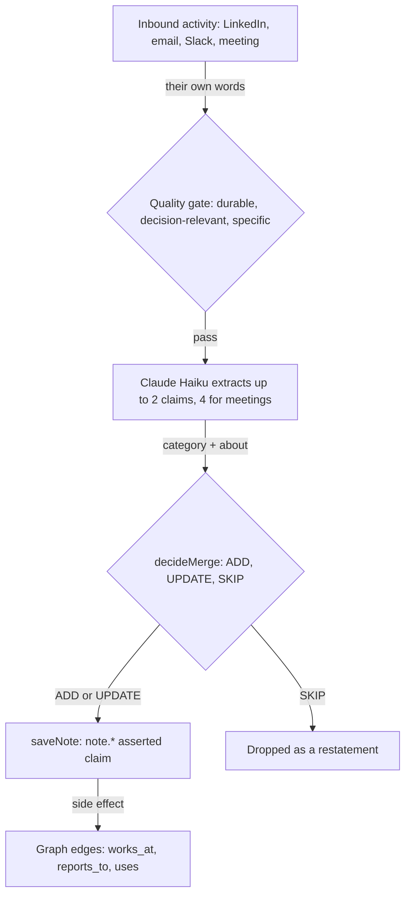

# Claims (Intel)

Most CRMs only hold the fields a human types into them. Nous also extracts durable **claims** from the actual conversation: what a person reveals about their goals, their stack, their pain, their budget, in their own words, across email, LinkedIn, Slack, and meetings. These extracted claims show up on a person under the **Intel** tab and an agent reads them in one call. This document describes the actual infrastructure. It is precise rather than illustrative, and it points at the code. For the substrate as a whole see [Context Graph](./context-graph.md); for the identity layer see [Identity Resolution](./identity-resolution.md).

---

## 1. What a claim is

A claim is the current best belief about one thing, with a confidence. Two kinds live in the graph, and the difference is how they are made:

- **Derived claims** are structured properties (`job_title`, `industry`, `deal_stage`) computed from observations by the claim engine. See [Context Graph](./context-graph.md) for the derivation pipeline.
- **Extracted claims** are durable, decision-relevant assertions pulled from a contact's own words: "evaluating Clay vs Apollo because Apollo's data went stale" is one, "has a call on Tuesday" is not. These are what the Intel tab shows, and they are the subject of this document.

A third thing is deliberately separate: **signals** are scoring features (hiring, funding, tech-stack change, intent) that feed the ICP and intent scores. They are not claims. See [ICP Scoring](./icp-scoring.md) and [Intent Score](./intent-score.md).

Extracted claims are stored as `note.<uuid>` asserted claims on the contact entity (`packages/core/src/db/notes.ts`). Because they are asserted, the derivation engine never overwrites them.

---

## 2. The claim taxonomy: what we extract

Every extracted claim carries exactly one **category** from a controlled set, and an **about** marking whether it concerns the person or their company. The taxonomy is controlled on purpose. Free-form categories cannot roll up across accounts; a controlled key plus a tagged subject turns claims into queryable patterns ("every account whose pain is fragmented tooling", "every champion who prefers LinkedIn").

The taxonomy lives in one place, `packages/core/src/db/claimCategories.ts`, so the extractor prompt and the validator never drift.

| Category | About | What it captures |
| --- | --- | --- |
| `status_quo` | either | How they work today: current tools, vendor, process, stack. |
| `goal` | either | An initiative, priority, or outcome they want to achieve. |
| `pain` | either | A stated problem or frustration, with the reason why. |
| `objection` | either | A concern that blocks a deal: price, security, timing, switching cost, competitor loyalty. |
| `authority` | person | Buying role and decision power: champion, blocker, economic buyer, user. |
| `budget` | either | Budget size, procurement process, or commercial constraint. |
| `timeline` | either | A buying or project timeline tied to a business reason. Never a meeting time. |
| `preference` | person | How to work with them: channel, cadence, communication style, format. |
| `competitor` | either | A competing tool they use or evaluated, why, and how loyal they are. |
| `relationship` | person | A durable connection to another person or org: reports-to, referred-by, knows. |
| `general` | either | Durable, decision-relevant context that fits none of the above. |

Anything the model returns outside this set is coerced to the nearest key (or `general`) by `normalizeClaimCategory`, so the data stays clean even when the model is loose.

---

## 3. The extraction pipeline

1. **Trigger.** After every qualifying inbound activity (`SIGNAL_WORTHY_TYPES` in `apps/worker/src/signals/index.mjs`), extraction runs. Outbound is excluded, so only the contact's own words become claims about them.
2. **Quality gate and extract.** `extractActivitySignals` calls Claude Haiku with a prompt built from the taxonomy. A claim is kept only if it is durable, decision-relevant, and specific. Cap of 2 claims per message, 4 per meeting.
3. **Dedup.** `decideMerge` runs semantic search over existing claims and asks the model to `ADD`, `UPDATE` an existing claim, or `SKIP` a restatement.
4. **Write.** `saveNote` stores the claim as a `note.<uuid>` asserted claim with its normalized `category`, its `about`, the content, and provenance metadata (`source_activity_id`, the channel, the extraction source).

---

## 4. What is stored per claim

Each extracted claim is a row in `claims` with `property = note.<uuid>` and a JSONB `value`:

| Field | Where | Notes |
| --- | --- | --- |
| content | `value.content` | the assertion, one self-contained sentence |
| category | `value.category` | one controlled key from the taxonomy |
| about | `value.metadata.about` | `person` or `company` |
| source | `value.source` | `signal_extraction` or `manual` |
| confidence | `claims.confidence` | 1.0 for asserted claims |
| valid_from | `claims.valid_from` | when the claim was recorded |
| invalid_at | `claims.invalid_at` | set when a claim is superseded or retired; null = current |
| provenance | `value.metadata.source_activity_id` | a pointer back to the source activity |

---

## 5. Querying claims

The point of a controlled taxonomy is the questions it answers across accounts: which accounts share a pain, which champions prefer which channel, which accounts run a given competitor. As the taxonomy and entity tagging deepen, these become first-class filters on the `query` surface (see [Context Graph](./context-graph.md)).
