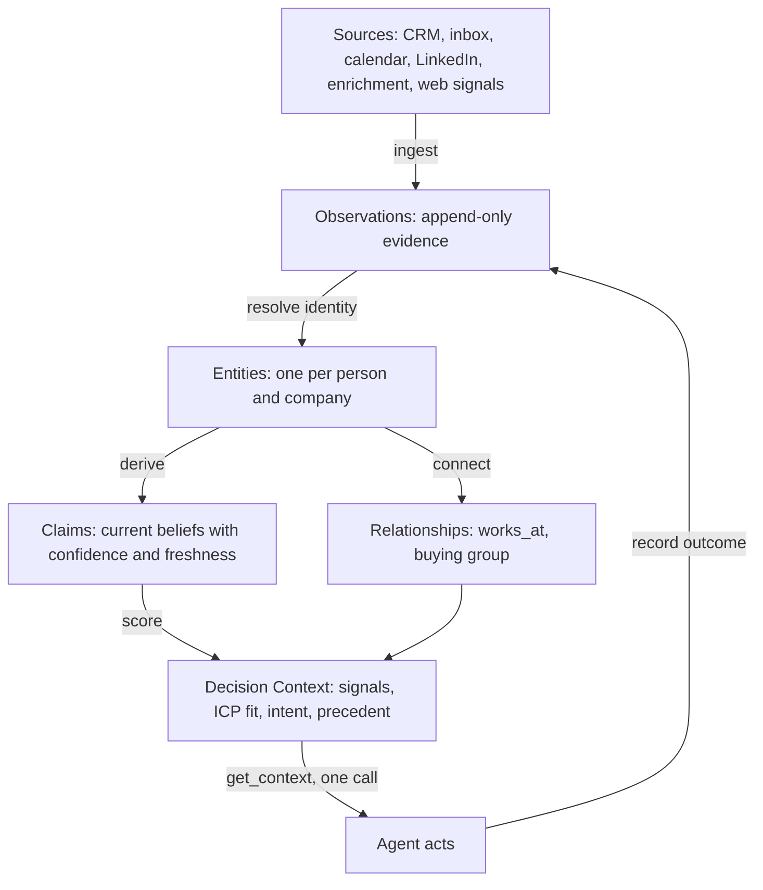
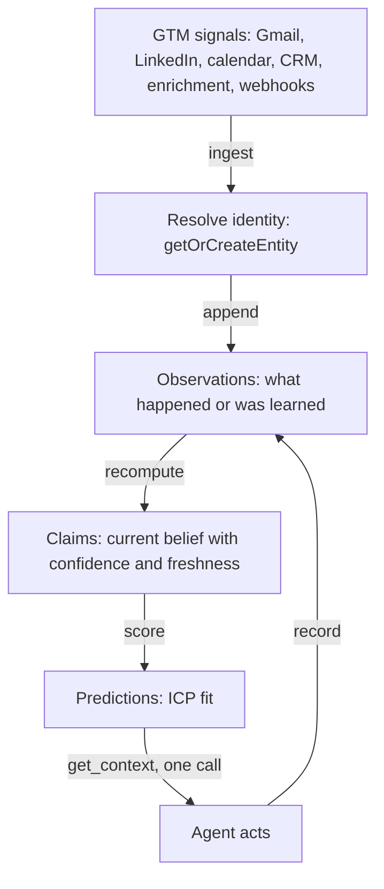
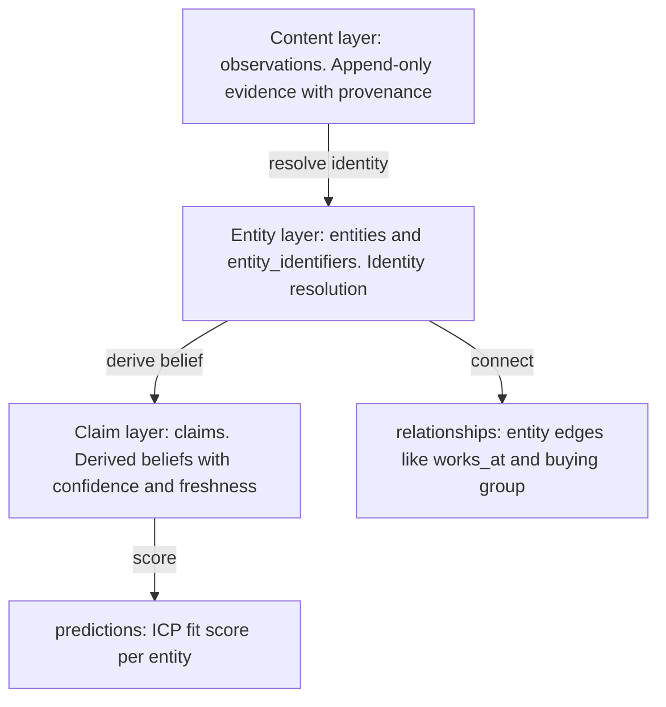
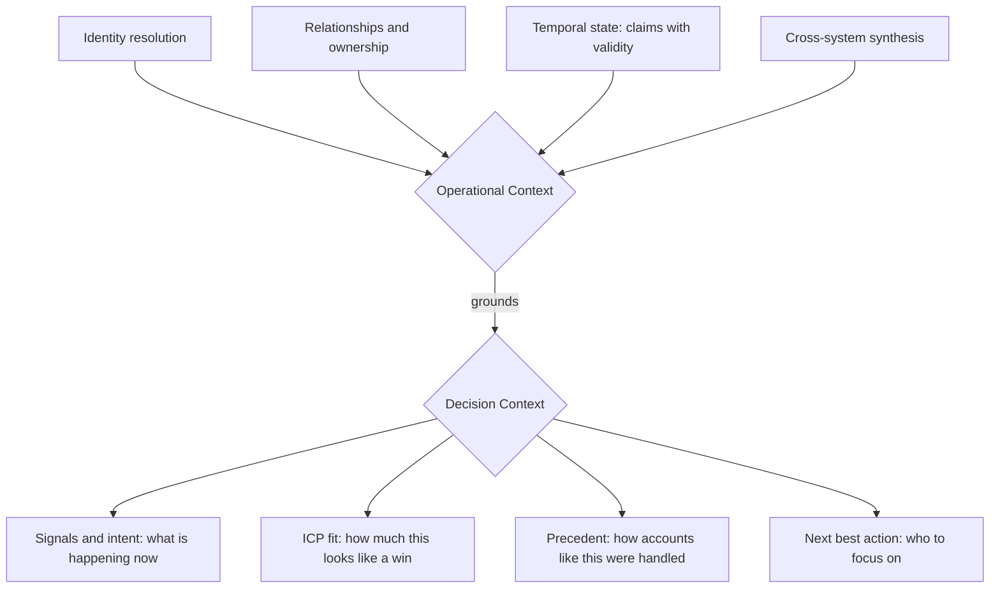
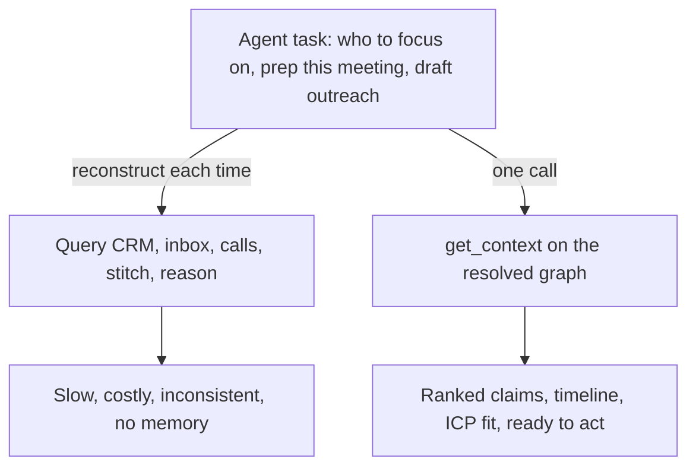

# The Context Graph

Most GTM tools store the current state of a record for a human to read. Nous builds a context graph: a living, identity-resolved model of your market that an agent reads in one call and acts on. This document is the comprehensive picture, what the context graph is, why GTM agents need one, and how Nous actually builds it. It is precise rather than illustrative, and it points at the code. For the identity layer specifically, it refers out to [Identity Resolution](./identity-resolution.md); for scoring, to [ICP Scoring](./icp-scoring.md) and [Intent Score](./intent-score.md).

---

## 1. Why GTM agents need a context graph

GTM is moving from software that multiplies a human to agents that do the work. The agent builds the list, researches the buyer, writes the campaign, runs the outreach. That shift breaks the old assumption every GTM tool was built on: that a person is the reasoning layer, holding the account in their head and filling the gaps from memory.

An agent has no memory and no intuition. It reasons only over the context you hand it, and its output is exactly as good as that context and no better. So the question stops being "which tool stores this" and becomes "what does the agent see before it acts."

Two structural problems make that hard, and both are GTM problems.

**The two clocks.** Every system keeps a state clock, what is true right now, and needs an event clock, what happened, in what order, and why. The stack built elaborate infrastructure for the state clock and almost nothing for the event clock. Your CRM says Acme is Closed Lost, 150K, last quarter. It does not say you were the second choice, that the feature that beat you ships next quarter, or that your champion was reorganized two weeks before the deal died. State overwrites. Events have to append. The reasoning that connects a signal to an action was never treated as data. The state-clock-versus-event-clock framing comes from Foundation Capital's [How do you build a context graph](https://www.linkedin.com/pulse/how-do-you-build-context-graph-jaya-gupta-xicwe/) and Graphlit's [Building the Event Clock](https://www.linkedin.com/pulse/building-event-clock-kirk-marple-ksnsc/), the clearest external writeups of why this layer has to exist.

**The fragmentation tax.** One account lives in a dozen systems: the record in the CRM, the engagement in the outbound tool, the conversation in the inbox, the meeting in the call recording, the intent in the marketing platform. A human paid this tax invisibly by rebuilding the account from memory. Hand the decision to an agent and the tax comes due in full, because the agent has nothing to rebuild from.

A context graph is the infrastructure that ends the fragmentation tax and builds the missing event clock, so the agent acts on a resolved, current account instead of reassembling it from scratch every time.

---

## 2. Why AI memory and RAG do not solve it

The obvious fixes are to bolt memory onto the agent or to point RAG at every tool. Neither solves the problem, and understanding why is the whole reason the graph has to exist.

**RAG retrieves text, not resolved entities.** Ask "what did Sarah say about the integration" and RAG returns documents containing those keywords. It does not know that Sarah is one person with a full history, that the integration connects three teams, or that the conversation moved across Slack, email, and a transcript. It stores similarity, not meaning. Crucially, point RAG at your stack and it finds documents mentioning "S. Chen," "Sarah," "@sarah," and "schen@acme.com" and never knows they are one person. Retrieval returns text that mentions an entity. It cannot return the resolved entity, because nothing in the corpus ever connected them.

**AI memory platforms store conversations, not organizational reality.** They remember what was said to the assistant. A memory of "user discussed Acme pricing" is not an understanding of Acme as an account with a buying committee, a relationship history, and a decision trail.

**Pointing the agent at every tool just moves the work to query time.** Reconstructing the account on every request works for ten accounts and dies in production for five reasons: cost (every call rebuilds the account), latency (seconds to assemble before reasoning starts), accuracy (the model fills missing data, 80 percent is normal and unacceptable for an autonomous action), consistency (a different window on a different day gives a different answer), and no learning (the context is discarded after each request).

The gap underneath all three is the same. They treat GTM knowledge as documents to embed or chats to remember. GTM knowledge is a graph: people connected to accounts, accounts to signals, signals to decisions, decisions to outcomes, all moving through time. The hard, unglamorous prerequisite, resolving who is who, modeling how they relate, and tracking what was true when, is what none of them do. We call that the operational context problem, and solving it is the point of the graph.

This is also our honest answer to "why can't I build this in Claude Code." You can build the agent in a weekend. You cannot build the operational context layer underneath it in a weekend. Resolving thousands of accounts times contacts times signals into canonical entities, kept current as tools change, is not a prompt. It is infrastructure, and it is what Nous is.

---

## 3. What the context graph is

A context graph represents your market the way a good rep reasons about it: as entities (this account, this buyer), relationships (champion, blocker, owner), claims (what is true, with how sure we are), and signals (what is happening right now). Not as tables and joins.

Nous is the context graph for GTM specifically. The entities are accounts, people, and deals. The relationships are buying groups and employment. The claims run from structured properties like title, seniority, and deal stage to the durable intel extracted from conversations: a goal, a pain, an objection, who the champion is, the competitor they run today. The signals are hiring, funding, tech-stack moves, and intent. It is wired to the one job GTM teams actually run, which is why it ships the GTM model pre-built instead of handing you a blank graph to define.

One design stance matters and we hold it deliberately: the graph is **graph-first, not RAG-first.** The retrieval that serves an agent is a structured query over resolved entities and derived claims, not a vector similarity search over text chunks. Embeddings exist in the system as an optional convenience, but the load-bearing path is the graph. We say more on this in section 8.

---

## 4. The architecture at a glance

Every signal becomes an immutable observation against a canonical entity. Identity resolution unifies the fragments. A derivation engine turns observations into claims that carry confidence and freshness. Relationships connect entities into a graph. Signals and scoring sit on top as decision context. An agent reads the resolved result in one call and acts, and its outcome flows back as a new observation. The whole thing is per workspace and yours.

---

## 5. The ingestion pipeline: data, entities, claims

The substrate header in `supabase/schema.sql` states the thesis in one line: store evidence, not values. You never store "title = VP Eng." You store every observation that bears on the title, immutably, and derive the current belief as a claim with confidence, provenance, and decay. Three steps turn raw data into served context.

**1. Data becomes observations.** Around 25 connectors (webhook handlers and pollers in `apps/worker/src/webhooks` and `apps/worker/src/pollers`) bring data in. Each event is written as an append-only row in `observations` (`kind` is `state` or `event`, plus `property`, `value`, `source`, `method`, and `observed_at`, the time it was actually true). Observations are immutable: a database trigger rejects deletes and any update except filling an embedding. This is the system of record, the evidence trail, and it is never rewritten.

**2. Observations resolve to entities.** Before anything is stored, the contact is resolved to one canonical entity through `getOrCreateEntity` (`packages/core/src/db/entities.ts`) and the webhook-side `resolveContact`. The matcher is deterministic and corroboration-gated, designed so two real people are never quietly fused. This is the hardest part of the system and it has its own deep-dive: see [Identity Resolution](./identity-resolution.md). For this document, the important fact is that resolution runs on the ingestion path, so every observation lands on the right entity from the start.

**3. Entities derive claims.** Each observation enqueues a recompute job (`claim_jobs`), drained every minute by `claimEngine.mjs`, which calls `recomputeClaim` and `deriveClaim` (`packages/core/src/db/claims.ts`). A claim is the current best belief for one property, carrying `confidence`, an `epistemic_class` (observed, inferred, predicted, asserted), a `freshness` state (fresh, aging, suspect, expired), `decays_at`, a `valid_from` and an `invalid_at`, and the `supporting_observation_ids` it was derived from. Claims are a regenerable cache: throw them away, replay the observations, and the whole belief layer rebuilds. A value you set by hand is written as an asserted claim with full confidence, and the engine refuses to overwrite it.

Two kinds of claims live here, and the difference is GTM-specific. **Structured claims** (title, seniority, deal stage) are derived from observations as above. **Extracted claims** are the durable intel pulled from a contact's own words across email, LinkedIn, and meetings: a goal, a pain, an objection, the champion, the competitor they run today. Each extracted claim carries a controlled category (`pain`, `goal`, `competitor`, `authority`, and so on) and an `about` (person or company), so claims roll up into patterns across accounts rather than sitting as loose notes. The taxonomy and the extraction pipeline have their own deep-dive: see [Claims (Intel)](./claims.md).

Signals are the third thing, and they are separate from claims. A funding event, a hiring spike, or a tech-stack change arrives as a `signal.*` observation and becomes a graded feature that feeds scoring (section 7). Claims tell the agent what is true. Signals tell it what is happening now.

---

## 6. The key components

| Component | What it is | Where |
| --- | --- | --- |
| `observations` | Append-only evidence. Every event and stated fact, with source, method, and the time it was true. Immutable. | `supabase/schema.sql`, `recordObservation` |
| `entities` | Canonical anchors for a person, company, deal, or the workspace itself. Hold almost no data; survive a job change. | `entities.ts` |
| `entity_identifiers` | The matching registry: every email, domain, LinkedIn URL, and CRM id, with one active entity per value. | `entities.ts` |
| `claims` | Derived current beliefs per property, with confidence, freshness, decay, temporal validity, and provenance. | `claims.ts` |
| `relationships` | Entity-to-entity edges (`works_at`, `reports_to`, buying-group ties) with their own validity window. | `schema.sql` |
| `predictions` | Claims about the future (ICP fit, will-reply, deal-close), each storing the feature snapshot it was scored on, resolved against the real outcome. | `predictions.ts` |
| Signals | GTM events (hiring, funding, tech, intent) written as `signal.*` and graded into scoring features. | `scorecard.ts`, `intentScore.mjs` |
| The serve layer | `get_context`, `get_account`, `query`, `verify`, `record`, exposed over MCP and the `/v2` REST API. | `context.ts`, `apps/mcp` |

The `contacts` and `companies` you see in the app are not tables. They are views computed live from claims, so there is one source of truth and no drift.

---

## 7. Two layers: operational context and decision context

The clearest way to think about the graph is as two stacked layers. The bottom one is the prerequisite almost everyone skips. The top one is what the market is racing to build.

**Operational context (the foundation).** Who exists, who owns what, how entities relate, and what was true when. It is built directly from the substrate: identity resolution collapses the fragments into one entity, relationships map the buying group and employment, claims carry temporal state, and cross-system synthesis pulls one account out of every tool. You cannot reason about a decision until you know who the actors are and what the world looked like at the time. This layer is what raw RAG and memory platforms never build, and it is where most of Nous's hard engineering lives.

**Decision context (built on top).** Once operational context exists, the GTM decision layer becomes possible: the signals and intent telling you what is happening now, the ICP fit telling you how much this account looks like a win, the precedent telling you how similar accounts were handled and what worked, and the next best action telling you who to focus on. For GTM this is the useful half: not a generic audit log of every approval and exception, but the precedent and meaning a rep would carry in their head.

The order matters. Decision context is only as good as the operational context under it. Score an account whose identity is fragmented and you score half a person. That is why we treat resolution and the claim layer as the load-bearing work, and the scoring and precedent as what they earn the right to compute.

This is the thought-leadership line worth holding: everyone wants to sell the decision layer, the precedent, the "why," the agent that acts. Almost no one has built the operational context underneath it. We did that first, for GTM, on purpose.

---

## 8. How it works at serve time

An agent does not get raw access to the graph. It gets a small, constrained set of verbs, the GTM equivalent of a safe and efficient query surface:

- **`get_context(focus, intent)`** assembles an intent-shaped, token-budgeted block for one account: the summary, the ICP fit with its reason, the durable facts, the ranked claims with confidence and freshness, the timeline, the stakeholders, and the open predictions. The five intents (`draft_email`, `follow_up`, `meeting_prep`, `call_prep`, `account_review`) shape which themes, window, and budget come back. This is `assembleContext` in `packages/core/src/context.ts`.
- **`get_account`** returns the full record, every claim plus the timeline.
- **`query`** is a constrained corpus surface, not raw SQL: scope filters, set difference, entity grouping, and value rollups across many accounts.
- **`verify`** re-derives a single claim from current evidence before the agent acts on it.
- **`record`** is the single write verb. The agent observes, Nous derives. There is no update verb on the substrate, so an agent can never overwrite the truth, only add evidence to it.

Two properties of this serve path are deliberate. First, it is **assembled from the resolved graph, not reconstructed from raw tools**: the account is already joined and scored, so the agent reads it instead of rebuilding it. Second, it is **structured, not RAG**: `assembleContext` does zero vector search. It pulls claims and observations by entity, ranks them by theme, confidence, and recency, and reads stakeholders off the relationship graph. Semantic search exists in the codebase, but only as an optional pre-filter on `query` and for notes search, and it degrades to structured retrieval when it is off. The context graph stands on the graph, not on embeddings.

The loop closes through `record`. A reply, an open, a closed-won, a closed-lost comes back as an observation. The account gets truer, and the ICP model sharpens from your own won and lost deals (see [ICP Scoring](./icp-scoring.md)). Every outcome is graded ground truth, which is the part no reconstruct-each-time agent can ever accumulate.

---

## What the context graph is not

- It is not RAG and not an AI memory platform. It resolves entities and derives claims, not chunks or chat logs.
- It is not an AI SDR, a sender, or a copywriter. That is cognition the model commoditizes, and it runs on top of the graph.
- It is not a CRM or a warehouse. Those store current state for a human. They feed the graph; they are not the foundation an agent runs on.
- It is not dashboards or report builders. The API is the product. A list is a saved query.

---

## Further reading

- [Identity Resolution](./identity-resolution.md), the substrate and the resolution waterfall in depth.
- [Claims (Intel)](./claims.md), the controlled GTM claim taxonomy and the extraction pipeline.
- [ICP Scoring](./icp-scoring.md), the deterministic scorer and the learning loop.
- [Intent Score](./intent-score.md), the second, decaying axis.
