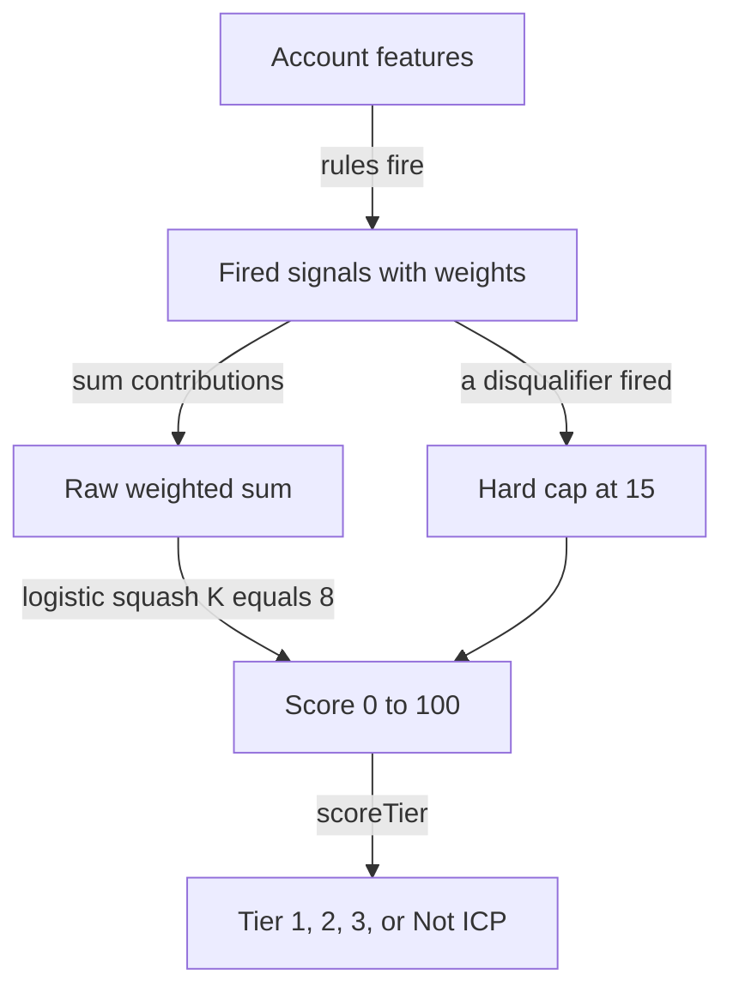
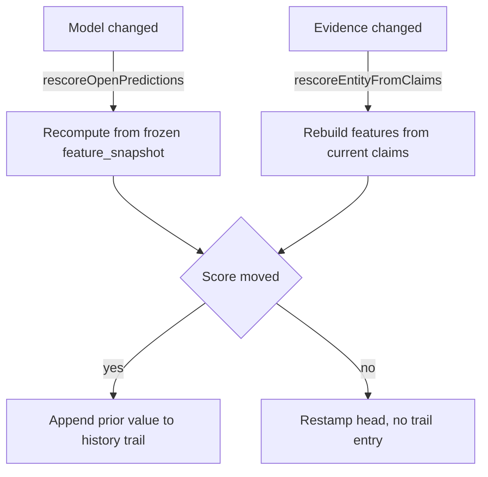
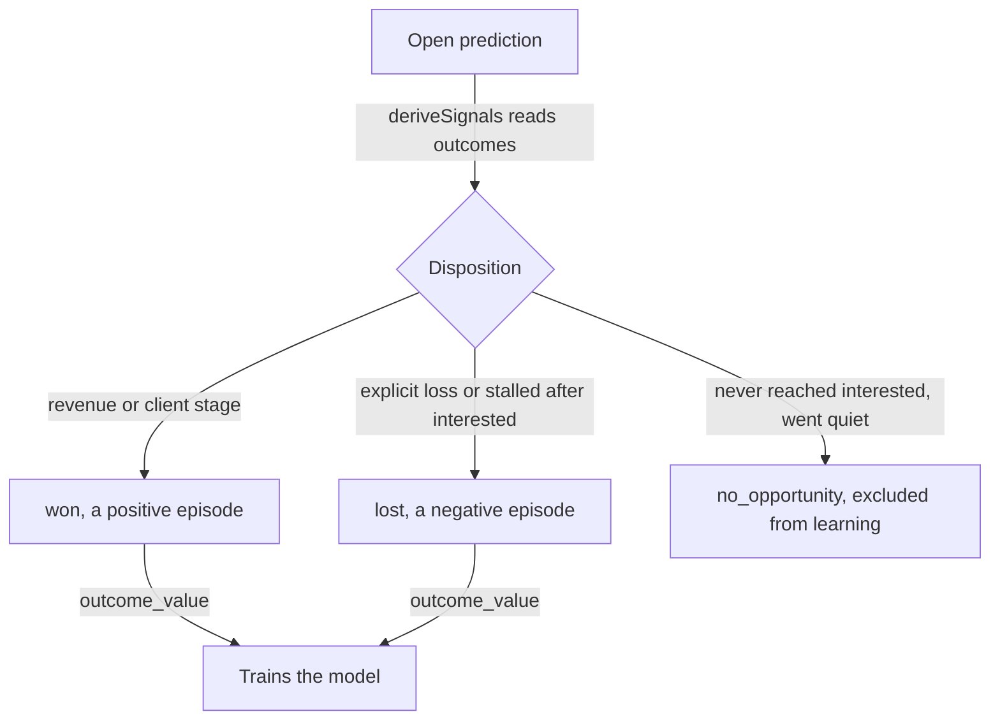
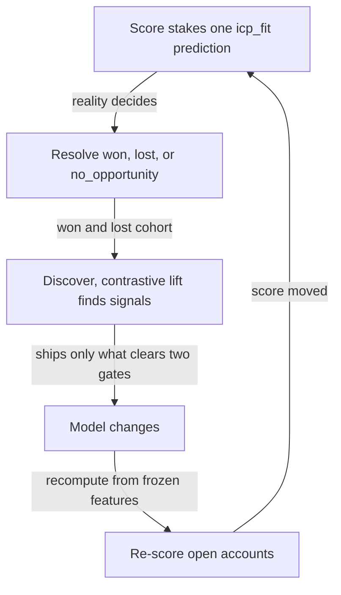

# ICP Scoring & GTM Context

Most CRMs let you tag an account "good fit" by hand and leave it there. Nous does the opposite. You describe your business once, every account gets a **0–100 ICP fit score** computed from real evidence, and every closed deal teaches the model who actually buys, so the score sharpens, moves as the account changes, and carries a dated trail of *why* it moved. Your agents read that score, not a stale tag.

This document describes the actual infrastructure: the substrate, the scorer, the three feature layers, the per-person score and its history trail, win/loss resolution, the nightly learning loop, the cold-start from closed deals, and the GTM Context and Playbooks that feed it. It is precise rather than illustrative, and it points at the code.

---

## 1. The substrate

ICP scoring sits on the same evidence substrate as [identity resolution](./identity-resolution.md), `entities`, `observations`, `claims`, plus four tables of its own.

| Table | Role | Key columns |
| --- | --- | --- |
| `predictions` | The staked bets. One `icp_fit` row per scored account, carrying the score, the exact features at scoring time, the model fingerprint, and once decided the realised outcome. | `entity_id`, `kind`, `predicted_value`, `feature_snapshot`, `model_version`, `predicted_at`, `resolved_at`, `outcome_value` |
| `scorecard_signals` | The live model, the weighted signal list the scorer evaluates. | `key`, `label`, `weight (−10..10)`, `rule`, `coverage`, `active` |
| `scorecard_runs` | The learning history, one row per nightly Mind run, with the calibration gap before and after. | `steps`, `gap_before`, `gap_after`, `signal_count`, `note` |
| `relationships` | `works_at` edges link a person to their employer, so company firmographics flow into the person's score. | `from_entity_id`, `to_entity_id`, `type`, `valid_to` |

Two structural facts drive the whole design:

**A score is a bet, not a column.** Scoring an account *stakes a prediction*, an immutable snapshot of what the model believed and how reliable that belief was. It is never mutated once it resolves. This is the only honest ground truth for "is the model getting better?", because you cannot grade a model whose past predictions you rewrite.

**The model is a list of rules, not a black box.** An ICP fit is the sum of weighted signals whose rules fire on the account's features, squashed to 0–100. You can read every signal, watch the weights move, and trace any score to the exact signals that produced it (`scorecard.ts` `scoreLead`). No LLM runs at score time.

---

## 2. The scorer

The score is a pure, deterministic function, `scoreLead` (`packages/core/src/db/scorecard.ts`). Sum the weights of every active signal whose rule fires, then squash that raw sum through a logistic curve to 0–100.



```ts
// scoreLead, packages/core/src/db/scorecard.ts
let raw = 0;
for (const s of signals.filter(s => s.active)) {
  const contrib = ruleContribution(s.rule, s.weight, features); // binary OR graded
  if (contrib !== 0) {                       // fire on ANY non-zero, negatives subtract
    raw += contrib; fired.push({ key: s.key, weight: contrib });
    if (s.rule.disqualify) excluded.push({ key: s.key });
  }
}
// Logistic squash. K=8 maps a single strong signal (±8) to ~73/27; raw 0 → 50.
let score = Math.round(100 / (1 + Math.exp(-raw / 8)));
// A fired disqualifier hard-caps the account below Not-ICP (§5), positives notwithstanding.
if (excluded.length) score = Math.min(score, EXCLUDED_SCORE_CEILING); // 15
```

A **signal** is `{ rule: feature OP value, weight: −10..10 }`, for example `industry == fintech → +6`, `pipe.touches_band == 10+ → −4`. The supported operators are `exists, ==, !=, >=, <=, >, <, in, scaled, contains_any` (the last matches exclusion terms against the `keywords`/`description` text). A rule may carry `disqualify: true` to hard-cap rather than just subtract (§5). `score >= 70` is the fit threshold (`scoreToPrediction`). The guard is `contrib !== 0`, not the old `> 0`, because that bug silently discarded every negative weight, so no detractor (learned *or* authored) ever moved a score.

### Binary vs graded (`ruleContribution`)

Categorical rules fire **binary**, full weight when the rule matches, nothing otherwise (you either are a founder or you aren't). But a buying **signal** carries a *strength* (a 0–10 score from signal-scan), and a strong signal should outrank a weak one. The `scaled` op grades it: a rule `{ feature: 'signal.friction', op: 'scaled', value: 5 }` contributes

```
weight × (score / 10)   when score ≥ value (the floor), else 0
```

So `friction 9/10 @ weight 5` adds `4.5`, `friction 6/10` adds `3.0`, and `friction 4/10` (below the floor) adds nothing. This is what lets the score **rank inside a tier**. Without it, every signal above the threshold counts the same and your best-fit accounts pile up indistinguishably. `fired` reports the graded contribution, so the reason trail reflects real strength, not the nominal weight.

> Trade-off to know: the logistic squash compresses the top (raw 24 → 95, raw 36 → 99), so graded signals separate the **middle** of the range cleanly but barely move an already-saturated top-tier account. Ranking the very top further is a logistic-`K` calibration choice, kept separate from the weights.

The logistic squash is deliberate. The earlier version rescaled `raw` against the *sum of every signal's weight in the catalog*, but an account only ever fires a **subset** (you can't be both `bootstrapped` and `series_a`), so each new signal inflated the denominator and deflated every real account's score (the 92→6 collapse). The logistic curve is stable no matter how many signals the catalog holds: one strong signal lands ~73, and signals stack from there.

### The model fingerprint

`modelVersion` (`scorecard.ts`) is a short, order-independent djb2 hash of the active signal set (each signal's key, weight, and rule). Two scorecards with the same fingerprint score identically, so a prediction stamped with an older fingerprint was scored under a now-superseded model and is a candidate for re-scoring (§5). This is what lets the system know, cheaply, which open accounts a model change actually affects.

---

## 3. The three feature layers

A good ICP is the intersection of *who they are*, *how they operate*, and *how the deal went*. All three flow into the `feature_snapshot` at scoring time, so the learning loop can discover lift on any of them.

| Layer | Examples | Source |
| --- | --- | --- |
| **A, Firmographics** (who they are) | `job_title`, `seniority`, `department`, `industry` (which carries the company *type* too), `employee_count`, `country`, plus the descriptive text `keywords` (array) + `description` that exclusions match with `contains_any` | website extractor + enrichment (Apollo / Prospeo) |
| **B, Buying signals** (how they operate / why now) | The canonical 6 classes, each a **0–10 strength**: `signal.domain`, `signal.friction`, `signal.hiring`, `signal.momentum`, `signal.stack`, `signal.intent` | signal-scan + content-scan, recorded on the **company** entity |
| **C, Pipeline & engagement** (how the deal went) | `pipe.lead_source`, `pipe.channel`, `pipe.inbound`, `pipe.replied`, `pipe.meetings_band`, `pipe.touches_band` | the activity log (`pipelineFeatures`) |
| **(D), Exclusion flags** (who we are NOT) | `exclusion.<key>`, a semantic disqualifier set by a website read (signal-scan) | recorded on the **company**, inherited like a signal (§5) |

The full vocabulary lives in `FEATURE_VOCAB` (`apps/api/src/lib/scorecardSeed.mjs`), the contract between the signal translator, the discovery engine, and the scorer.

### Where the features come from

Layer A/B start with **enrichment** (`apps/api/src/services/enrichment.mjs`): per contact, Nous tries Apollo BYOK → Prospeo BYOK → the platform Prospeo key for job title, seniority, department, and company info. Enriched attributes are written as **observations tagged with their true source**, never flattened onto the record, so a value's origin survives for the claim engine. Layer C is derived live from the entity's `interaction.*` observations by `pipelineFeatures`.

`buildEntityFeatures` (`packages/core/src/db/predictions.ts`) is the single feature-extraction path shared by the first score and every re-score, so the two never drift. It reads the person's own claims, follows the `works_at` edge to merge the employer's company-level claims, inherits the company's **buying signals** as graded numeric features (each `signal.<class>` claim becomes `signal.<class> = its 0–10 score`), inherits its **`keywords` / `description` text and any `exclusion.*` flag**, and folds in the pipeline features. These all live on the **company**, so every person at that company inherits them. Score the company's friction (or flag its exclusion) once and the whole buying committee re-scores (§5).

The signal taxonomy is **locked**. The six classes above are the only `signal.*` features the model may reference. `normalizeScorecardRule` (`apps/api/src/lib/scorecardSeed.mjs`) enforces this on every seed: it repairs the nested `{ feature: { op, value } }` rule shape to flat `{ feature, op, value }`, forces any `signal.*` rule to the `scaled` op, and drops `signal.*` rules that name an unknown class. This closes the failure mode where a model was seeded with signal keys signal-scan never produces (so no rule ever fired and every account scored a flat 50).

---

## 4. The per-person score, and its history trail

The score is **per person**, not per company. A founder and their SDR at the same company get separate predictions, because role and engagement differ. (A company roll-up takes the max of its people's scores.) Each person's score is one `predictions` row of `kind='icp_fit'`, and it carries its own evolving trail.

### The shape of a prediction

```jsonc
// predictions.predicted_value
{
  "score": 91,
  "fit": true,
  "reason": "Scorecard: 3 signals fired: founder_led, seed_stage, hiring_sdr",
  "rescored_at": "2026-07-02T…",
  "history": [
    { "score": 87, "fit": true, "reason": "…", "at": "2026-06-27T…", "model_version": "sc_a1b2" },
    { "score": 99, "fit": true, "reason": "…", "at": "2026-06-27T…", "model_version": "sc_a1b2" }
  ]
}
```

The **head** is today's best estimate. The **`history` array** is the dated trail of every prior value, newest-first. Together they read as the account's score story, exactly the Yusuf Ongel trail:

```
Yusuf Ongel · ICP score history
  Jun 27 · 99 → 87   ▼12   seeded 99 from lookalike → re-scored on signals
  Jun 27 · 87 → 91   ▲4    + signal.friction (9/10) "high-volume vs personalization"
  Jul 02 · 91 → 96   ▲5    title: Founder → Founder & raised seed; + hiring 2 SDRs
  Jul 09 · 96 → 93   ▼3    no activity 30d, freshness decay
```

Each line is `date · score · delta · the claim/signal that moved it`. The delta comes for free (consecutive scores), and the attribution comes from the **`feature_snapshot` diff** between the prior entry and the new one.

### What writes a history entry

A trail entry is appended only when an **open** prediction's score actually *moves*. Two paths do this, and both live in `packages/core/src/services/rescore.ts`. The split is whether the model changed or the evidence changed:



- **`rescoreOpenPredictions`**, the **model changed**. After the nightly Mind ships a signal change, every open account is recomputed *from its frozen `feature_snapshot`* (the model moved, not the evidence). If the score moved, the prior value is pushed into `history` and the head is updated.
- **`rescoreEntityFromClaims`**, the **evidence changed**. Called from the claim engine the moment a score-affecting claim is recomputed (enrichment lands a title, a website signal arrives, a position changes). It rebuilds the entity's features from its *current* claims, re-reads employer + pipeline, refreshes the `feature_snapshot`, and if the score moved, appends to `history`.

Both share one discipline:

```ts
// rescore.ts, score moved: preserve the prior score as a trail entry
const priorEntry = { score: prev.score, fit: prev.fit, reason: prev.reason,
                     at: prev.rescored_at || open.predicted_at, model_version: open.model_version };
update({ predicted_value: { score, fit, reason, rescored_at: nowIso, history: [priorEntry, ...priorHistory] } });
```

When the score *doesn't* move, the row is **restamped** (model version / snapshot refreshed) with **no trail entry**, so the trail stays signal, not noise. Mutating an *open* prediction is safe, because it isn't a graded bet yet. The instant it resolves it freezes with its history intact (§5).

### The one principle: the bet vs. the current fit

- A **resolved prediction is an immutable bet**: "on date X, under model vN, we scored them 82, and they converted." Never mutated. The only honest measure of model quality.
- The **current fit** is today's estimate of an *open* account, recomputed as model and data change. Re-scoring touches the open estimate only. Resolved bets stay frozen.

### How it surfaces

`icpFit` (`apps/api/src/lib/icpFit.mjs`) returns `{ score, fit, tier, reason, scored_at, history, outcome_score }` to agents through `get_context` / `get_account`, so an agent sees not just *who you sell to* but *whether this specific account is one of them, what to do about it* (`tier`, see §5), *how confident, and how that fit has evolved* (`history` is the full trail of prior `{ score, reason, at }` entries).

Both the human and the agent see the trajectory. The **contact record** (`PeopleDetail`, `People.tsx`) renders, under the headline score, the **tier badge + recommended play**, the **reason** the score is what it is ("Excluded, not a fit: …" / "3 signals fired: …"), and the **dated history trail** with per-step deltas, read straight from `prediction.history` (the `/api/contacts/:id` endpoint already returns it). The list surfaces stay calm, a single number + tier, but on the record you can see "was 87, dropped to 75 after 30 days quiet, back to 91 when they hired a RevOps lead" and act on the *trajectory*. The agent reads the same trail via `get_account`.

> **In progress.** The `reason` on each entry is currently the signal-list summary from `scoreToPrediction` ("3 signals fired: …"). The richer per-line attribution in the Yusuf trail ("+ signal.friction (9/10)", "title: Founder → Founder & raised seed") is computed from the `feature_snapshot` diff between consecutive entries. Surfacing that diff *as* the reason is the active refinement, and the data to produce it (both snapshots) is already stored on every history step.

---

## 5. Tiers, the score made actionable

A 0–100 number tells you *how good* an account is. It doesn't tell a rep *what to do*. The **tier** does. It's the thin, decisive layer on top of the score, the same idea behind account-based tiering, but computed per person and kept live. The score is the engine, the tier is the steering wheel.

`scoreTier` (`packages/core/src/db/scorecard.ts`) maps a score to one of four classes against configurable thresholds (`DEFAULT_TIER_THRESHOLDS` = 85 / 70 / 50):

| Tier | Band | The play (`TIER_META`) |
| --- | --- | --- |
| **Tier 1** | 85–100 | Work by hand, deep personalization, 1:1 outreach. The accounts you prepare so completely the rep just shows up. |
| **Tier 2** | 70–84 | Queue to automation, base sequence with the extracted variables. Lighter touch. |
| **Tier 3** | 50–69 | Nurture, low-cost touch, watch for a buying signal that promotes them. |
| **Not ICP** | <50 | Suppress, outside the profile, don't spend. |

Three properties make the tier more than a label:

**It's computed once, at the source.** `scoreToPrediction` returns the tier alongside the score, so every prediction write (the first stake, both re-score paths, and each history entry) persists `tier` in `predicted_value`. Predictions written before tiers existed get the tier derived on read (`tier ?? scoreTier(score)`), so nothing is ever blank.

**It's per person, and dynamic.** Because tiers ride on the per-person prediction (§4), a founder and their SDR at the same account land in different tiers. You work the founder by hand and skip the IC. And because the score re-scores on new evidence, a Tier 3 account that posts a buying signal (`signal.intent` from content-scan) crosses the threshold and **auto-promotes to Tier 2**, the continuous loop turned into a queue change, not just a number nudge.

**It drives the motion, everywhere.** The tier surfaces on the person record (a badge + its recommended play), as a column (with tier-filter chips and tier-sort) on both the **lead list** *and* the **People / Accounts page**, and in the agent surface (`get_context` / `get_account` return it). All three read **one source**: `fetchIcpByEntity` (`icpFit.mjs`) overlays the live prediction's `score` + `tier` at read time, so no surface can show a different number than the record (it replaced the stale v1 `contacts.icp_score` the People page used to read). The `abm-operator` agent routes by it: Tier 1 hand-prepped, Tier 2 drafted and queued, Tier 3 nurtured, Not-ICP suppressed, so "who do I work today, and how" is answered by the same model that scores them.

> **On the roadmap.** Per-workspace threshold overrides (the bands are defaults today), server-side tier filter/sort across the *whole* contact book (the People page filters the loaded set today, like its other filters), and **override-to-learn**: a manual tier change is a labeled training signal with the same plumbing as a closed-won outcome (§6), so correcting the model teaches it.

### Exclusions, "who we are NOT"

Inclusions say who you sell to. **Exclusions** say who you refuse, and they have to *win* over a strong-looking profile. A 2–20-person agency that also happens to be a pure branding/messaging shop matches your firmographics and would score high on positives alone, but if "no branding agencies" is part of your ICP, it must come out **Not-ICP regardless**.

That is what a **disqualifier** does. An exclusion is an ordinary scorecard signal carrying `disqualify: true` on its rule and a negative weight. When its rule fires, `scoreLead` (`scorecard.ts`) **hard-caps the score at `EXCLUDED_SCORE_CEILING` (15)**, below the Not-ICP floor, no matter how many positive signals also fired, and the prediction's reason leads with *why* ("Excluded, not a fit: …"). The cap, not the weight, is what makes it decisive.

Two design points:

- **Negatives actually subtract now.** The scorer sums every firing signal's contribution whether positive *or* negative (the earlier `contrib > 0` guard silently discarded all negatives, so neither an authored exclusion nor a learned loss-driver ever moved a score). A non-disqualifying negative weight is the *soft* version, it pulls the score down but can be outvoted. A disqualifier is the *hard* version that caps.
- **Exclusions are authored, from the ICP prose.** Unlike the loss-drivers the loop *learns* from outcomes (§7), exclusions are stated by you. `seedScorecardFromMemory` (`scorecardSeed.mjs`) reads any "not a fit / we don't work with / avoid" language in your ICP and emits a disqualifying signal per stated exclusion. It picks the binding cheapest-first, a **three-tier ladder**:
  - **1. Firmographic.** When a feature value cleanly isolates the excluded kind (a whole `country`, an `industry` you never sell to), bind to that feature with `==`/`in`. Fires at score time, no extra work, wherever enrichment populates the feature.
  - **2. Keyword / text.** When an *included* kind shares the same firmographics (the canonical trap: exclude **cold-calling** agencies while **cold-email** agencies are your lead ICP, both are `industry=agency`), a firmographic rule would nuke your real ICP. So the seed emits a **`keywords contains_any [terms]`** disqualifier instead: high-precision terms the excluded kind's enrichment text carries but the included kind doesn't (`cold calling`, `telemarketing`, `dialer`, not `appointment setting`). This is the **automatic** layer: it fires at score time off the descriptive `keywords`/`description` text **Apollo/Prospeo already return** (we now capture it onto the company entity, `captureCompanyKeywords` in `enrichment.mjs`, having previously dropped it), so most cold-callers are caught with **no website read**.
  - **3. Semantic (website read).** The backstop for what keywords miss. The seed also emits a **`exclusion.<key>`** (op `exists`, `disqualify`) that stays dormant until **signal-scan** reads the site, judges it against the exclusion's description (shown in the `export_icp_model` write-back block under "Not a fit"), and on a genuine match records `exclusion.<key>` on the company with the ordinary **`record`** tool, **no new MCP tools**.

  `contains_any` (a new operator in `scoreLead`) and `exclusion.*` claims are both **inherited from the company to every person** (the same `works_at` rail as `signal.*` in `buildEntityFeatures`), so a flagged cold-caller caps the whole buying committee. And because a signal/exclusion on the company drives the *people's* scores, recording one now **fans out and re-scores every person at that company immediately** (`rescoreCompanyMembers`, wired into the sync write-path and the claim-engine worker), not on the next nightly pass. The chosen policy is that a keyword match **hard-caps** (the seed forces `disqualify` on any negative `keywords` rule, since the LLM emits it inconsistently). Re-seeding is non-destructive: `seedSignals` clears only seed-origin rows (`added_in IS NULL`) and upserts, so editing your exclusions never wipes what the loop learned from real deals. The honest limit: a semantic/keyword exclusion only *acts* once an account is enriched (keywords) or scanned (website), because already-scored accounts drop on their next enrichment/scan, since "is this a cold-caller?" doesn't exist in the data until something reads it.

---

## 6. Win/loss resolution, closing the loop

A staked prediction is a question reality eventually answers. Resolution joins each open prediction to what actually happened and writes the one weighted `outcome_value` the learning loop trains on. This is the **single source of truth** for disposition, `packages/core/src/services/outcomes.ts`, called from two entry points that share `resolveOnePrediction` so the rules never fork:

- **`resolveEntityPredictions`**, event-driven. The moment a won/lost activity lands, `logActivity` fires it and the prediction closes immediately. No nightly wait for the cases that matter.
- **`resolveOpenPredictions`**, the nightly backstop (`apps/worker/src/workers/mindOutcomes.mjs`). Sweeps accounts that no event will ever fire for (went quiet past their window), plus a late-revenue upgrade pass.

### The disposition



`deriveSignals` reads three things for each prediction: a **reply** inside the resolution window, **pipeline movement** (the current `pipeline_stage` claim vs. the snapshot's stage), and **revenue / explicit loss** (any time after the prediction). From them:

| Disposition | When | Counts as |
| --- | --- | --- |
| `won` | a revenue observation (`deal_won`, `payment_received`, `proposal_signed`) **or** reaching the `client` stage | a positive episode |
| `lost` | an explicit `deal_lost` / `deal_disqualified`, **or** the account reached `interested`+ (a real opportunity) then stalled past its window | a negative episode |
| `no_opportunity` | scored but never reached `interested` and went quiet | **excluded** from learning, noise, not a loss |

A win or an explicit loss resolves **immediately**. Only the nightly backstop times an account out (`requireWindow`). The realised `outcome_value.score` is a weighted 0–1 blend, reply `0.25`, pipeline advance `0.35`, revenue `0.40` (`computeOutcomeScore`), and revenue is watched for 120 days because it lands slowly.

The qualification bar matters: an account has to have *entered a buying motion* (`interested` rank ≥ 2) for a non-close to count as a genuine **loss**. Below that, silence is `no_opportunity` and the model learns nothing from it. Going quiet on a lead you never engaged is not evidence about fit.

---

## 7. The learning loop, score → resolve → discover → re-score

The compound-intelligence loop, made of real tables (`observations → claims → predictions → scorecard_signals`):



1. **Score.** `scoreEntities` (`apps/worker/src/workers/scoreEntities.mjs`) stakes one `icp_fit` prediction per scoreable person. Each entity is scored **exactly once**, its open prediction is re-scored in place (§4) and frozen on resolution. Re-staking churned closed-won customers back into the pipeline as fresh "Pending" rows.
2. **Resolve.** §5 closes each bet to `won` / `lost` / `no_opportunity`.
3. **Discover.** The nightly Mind (`scorecardLoop.mjs`) sweeps the resolved won/lost cohort for features that separate winners from losers, proposes the strongest as new signals, and ships only what survives two gates.
4. **Re-score.** When the model changes, every open account's current fit is recomputed in place from its stored features (§4), and the move shows up as a trail step.

### The scoreability gate

An entity is scored only when it carries at least one **scoreable** feature (`job_title, seniority, department, industry, employee_count`, `hasScoreableFeature`). A name-and-pipeline-only contact is *awaiting enrichment*. Staking it would record a hollow `0` that is indistinguishable from a genuine bad fit and pollutes calibration. The gate is enforced in `scoreAndStake` **and** duplicated in plain JS in the worker, so a stale compiled core can't bypass it.

### Discovery, contrastive lift

`discoverSignals` (`packages/core/src/discovery.ts`) is the deterministic, no-LLM candidate source. For each candidate `feature == value`, it computes the **lift**, the win rate of accounts *with* the trait over the win rate of accounts *without*, and maps lift to a weight in bands (`weightFromLift`: ≥3× → +8, ≤0.33× → −8). Several mechanisms keep outliers from distorting the ICP:

- **Cohort thresholds.** A trait needs **≥4 real deals with it** (and ≥4 without, ≥8 total) before it can become a signal. Close 15 software / 3 agency / 2 local → only `industry=software` clears the bar. The outliers wait until they accumulate, then earn their own signal, it *compounds*.
- **Recency decay.** Each deal's vote decays with a 180-day half-life from `resolved_at`, so a **pivot shifts the ICP faster**, old evidence fades instead of voting forever.
- **Volume-weighted confidence.** A signal's band weight is shrunk by `withW/(withW+5)`, so a lift backed by 15 deals is sturdier than the same lift on 4.
- **No leakage.** `isNonFeatureProp` bars identity/metadata/outcome-leaky fields (names, emails, vendor `*_id`s, `*_at` timestamps, `pipeline_stage`, `deal_value`) from ever becoming a signal.

### The two gates

Every proposed change, whether from discovery or from the LLM reflection pass that fills the remaining steps, must clear both before it ships (`runForWorkspace`):

1. **Accuracy.** The **calibration gap** on a *time-held-back 30%* split must rise. The gap is `avg(outcome | score ≥ 60) − avg(outcome | score < 60)`, a well-calibrated model scores converters higher than non-converters, so the gap is large and positive.
2. **Carry-over.** An LLM judge (Haiku) asks whether the signal would plausibly hold for *future* accounts in a different campaign, or is overfit to one batch. Fails closed.

The catalog is capped at 12 active signals, forcing the loop to prune as it learns. Every run logs a `scorecard_runs` row (gap before → after) so the [GTM Context page](#9-the-gtm-context-the-system-of-record-the-model-reads) can plot the model sharpening over time.

---

## 8. The cold-start, build from closed deals

A brand-new workspace has no resolved predictions, so there is nothing to learn from. The closed-deals flow seeds the loop. Paste won + lost domains, and `POST /api/mind/closed-deals` runs the whole cycle per account (`apps/api/src/routes/api/mind.mjs`):

1. **Read the site.** Extract firmographics (Layer A) + behavioural signals (Layer B), saving the "what they do" summary.
2. **Recognise the account.** Find the contacts you *already have* at that domain (via the company record, the contact's domain, or email as fallback), link them with `works_at`, and record the won/lost on each, so their open prediction resolves and their pipeline history (Layer C) joins the deal. The most senior contact supplies the deal's buyer traits.
3. **Discover.** Contrastive lift over the cohort, or, when there are too few deals for lift to mean anything, a winner-signal fallback proposes what your winners share (with an honest "sharpens as more deals close" note).
4. **Surface.** The closed-deal companies are scored and resolved, so they appear in the analyzed table as real won/lost rows.

This is also where the model is first **seeded** from your plain-English ICP. `seedScorecardFromMemory` (`apps/api/src/lib/scorecardSeed.mjs`) translates your GTM Context (ICP / Market / Product / Pricing / Positioning) into 4–8 weighted inclusion signals, *plus a disqualifying exclusion for each "not a fit" the ICP states* (§5), via Haiku, under a strict prompt: *preserve stated numbers exactly* ("1–20 employees" → `employee_count <= 20`, never loosened), map descriptors to the tightest faithful rule, invent nothing (including: never invent an exclusion the ICP didn't state). The learning loop then sharpens that seed and adds the *soft* negative signals it discovers from real outcomes.

---

## 9. The GTM Context, the system of record the model reads

The model doesn't learn in a vacuum. It starts from what you tell it. The **GTM Context** page (`apps/frontend/src/pages/Intelligence.tsx`, route `/intelligence`, labelled "GTM Context") is the workspace's source of truth about *your* business: ICP, Market, Product, Pricing, Competitors, Positioning, GTM Motion, Notes. Each field is a `claim` carrying a subject slot, a confidence, and a source (`you` edited it, `site` drafted it, `Claude` wrote it back).

- **It evolves, it doesn't pile up.** Re-stating a fact in a slot *supersedes* the old value (kept as history) rather than duplicating. Stale or AI-drafted fields are flagged "worth revisiting."
- **Agents read and write it both ways.** `get_playbook` / `get_context` read it. Durable changes are written back by syncing the user's own files: **`sync_icp`** for ICP/context, **`sync_playbook`** for a playbook, **`set_workspace_profile`** at onboarding (the old `update_gtm_profile` tool was retired in favour of the file-sync model). The Context is the seed for the ICP model (§7).

### ICP file symbiosis

A Claude Code user already keeps an `icp.md` (or `positioning.md`, `pricing.md`) in their own repo. Rather than fork a second ICP in the web UI, Nous reads and writes *their* file:

- **`sync_icp`** syncs the user's existing ICP/positioning files **into** the graph (file → graph), recording the source path. First sync usually builds the scoring model.
- **`export_icp_model`** writes the *learned* model **back** into their file as a fenced `nous:icp` block (graph → file), so the model the loop discovered lives in their repo, next to the ICP they wrote.

The `/playbook` page mirrors the synced ICP read-only. The graph is the runtime-agnostic source of truth. The Claude Code file is an optional mirror.

**An edit is inert until synced.** Editing `icp.md` does not change the score, the exclusions, or what other agents read until `sync_icp` runs, because the model is rebuilt *on sync*, not on file save. This is enforced two ways so an agent reliably does it: the `sync_icp` / `sync_playbook` tool descriptions and the workspace guidance state it as a hard rule ("after ANY edit you MUST call `sync_icp` this turn"), and the Nous Claude Code plugin ships a `PostToolUse` hook that fires on any edit of a context/ICP/playbook file and injects a sync reminder.

---

## 10. Playbooks, the policy layer

Facts tell an agent *who* an account is. **Playbooks** tell it *how you operate*, the rules the agent should follow before it acts. They are a thin, deliberate four-kind set (`apps/api/src/routes/v2/playbooks.mjs`):

| Kind | What it governs |
| --- | --- |
| `voice` | Voice & tone, how copy should sound |
| `outreach` | Outreach rules, cadence, channels, what not to do |
| `icp` | The ICP in prose (distinct from the *scored* model, this is the human-readable policy) |
| `positioning` | How you frame the product against the market |

The `playbooks` table holds one row per `(workspace_id, kind)` with `body_md`, `source` (`claude_code` when synced from a file, else `nous`), `file_path`, a monotonic `version`, `content_hash`, and `synced_at`. Two MCP tools front it:

- **`get_playbook(kind)`** lets an agent read the rules before acting (for example `email-writer` reads `voice` before drafting).
- **`sync_playbook`** pushes a Claude Code file edit up into the graph, bumps `version`, stamps `synced_at`.

`POST /v2/playbooks/:kind` is the write path (auth = the `pk_` workspace API key), `GET /v2/playbooks` the read. Like the ICP file, Nous is the runtime-agnostic source and the Claude Code file is an optional mirror, the `get_workspace_status` onboarding routine prompts the user to sync their playbooks on setup. Playbooks are a Cloud-layer feature (`icpScoring` / managed layer gated by `requireFeature`). The open self-host build leaves the scoring model and context open and unmetered.

---

## 11. The agent surface

What an agent can do with all of this, through the MCP server (`apps/mcp/src/server.js`):

| Tool | Purpose |
| --- | --- |
| `get_context` / `get_account` | read an account's facts **plus** its ICP fit head (`icpFit`) |
| `get_playbook` | the workspace's ICP, market, pricing, positioning |
| `sync_icp` / `export_icp_model` | sync the user's ICP file in (rebuilds the model) / write the learned model out |
| `build_scoring_model` | translate GTM context into the weighted scorecard |
| `get_playbook` / `sync_playbook` | read the policy rules / push a file edit up |
| `record` / `record_signal` / `record_closed_deals` | feed evidence and outcomes back into the loop (an `exclusion.*` claim via `record` flags a semantic exclusion) |

The discipline the workspace guidance enforces: read `get_playbook` (and the relevant playbook) at the *start* of GTM work, act on the engineered record's ICP fit rather than a guess, and `record` what happened *after*, so the next score, and the next agent, start from the truth.

---

## 12. Honest limits

- **The trail reason is signal-list-based today.** Each history entry's `reason` is the "N signals fired: …" summary, not yet the per-claim snapshot-diff attribution shown in the Yusuf trail. The diff data is stored on every step. Surfacing it as the reason is the active refinement (§4).
- **Two "current fit" stores still coexist underneath.** The v1 `contacts.icp_score` column still exists, but every *read* surface (lead list, People page, contact record, agent tools) now overlays the prediction-based fit via `fetchIcpByEntity`, so the v1 column is no longer what anyone sees. Fully removing the column is deferred. The displayed score is unified.
- **A semantic/keyword exclusion only acts once the account is enriched or scanned.** "Is this a cold-caller?" doesn't exist in the data until enrichment lands the keywords or signal-scan reads the site, so an already-scored account drops on its next enrichment/scan, not the instant you add the exclusion. Firmographic exclusions apply at score time with no such wait.
- **Companies are scored only via the closed-deals flow** today, not by a general company-scoring worker. People are scored by `scoreEntities` and rolled up to the company as the max.
- **Single-mention `signal.tech.*` is noisy at low deal counts.** The ≥4-deal threshold and volume weighting are what tame it as deals accumulate.
- **Live vs. closed engagement differ.** Engagement features in a *live* prediction reflect engagement-so-far (frozen at scoring time). In a closed-deal episode they reflect the whole deal. The time-held-back calibration gate guards the difference.

---

## 13. The guarantees, and the guards that enforce them

| Guarantee | Guard | Where |
| --- | --- | --- |
| A resolved score is never rewritten | re-score paths select `resolved_at is null` only | `rescore.ts` |
| An unenriched account never gets a hollow 0 | `hasScoreableFeature` gate, enforced twice | `predictions.ts`, `scoreEntities.mjs` |
| A score change is always explained | prior value pushed into `predicted_value.history` with its model_version | `rescore.ts` |
| A trait can't become a signal on an outlier | ≥4-with / ≥4-without cohort threshold + held-back gate | `discovery.ts`, `scorecardLoop.mjs` |
| Identity/outcome fields never leak into the model | `isNonFeatureProp` bars names, ids, timestamps, stage, value | `discovery.ts` |
| The ICP follows where the business is going | 180-day recency half-life on each deal's vote | `discovery.ts` |
| Going quiet isn't mistaken for a loss | `no_opportunity` below the `interested` bar, excluded from learning | `outcomes.ts` |
| A seeded model stays faithful to the stated ICP | strict "never loosen a threshold" translation prompt | `scorecardSeed.mjs` |
| A change ships only if it generalises | accuracy gap + LLM carry-over, both fail-closed | `scorecardLoop.mjs` |
| An authored exclusion wins over any stack of positives | a fired `disqualify` rule caps the score at `EXCLUDED_SCORE_CEILING` | `scorecard.ts` |
| An exclusion never nukes a look-alike you *want* | seed binds it keyword/semantic (not firmographic) when an included kind shares the firmographics | `scorecardSeed.mjs` |
| Editing your exclusions never wipes learned signals | re-seed clears only `added_in IS NULL` (seed-origin) rows | `scorecard.ts` (`seedSignals`) |
| Every read surface shows the same fit as the record | one `fetchIcpByEntity` overlay feeds list + page + agent | `icpFit.mjs` |

---

## 14. What you get

One evolving 0–100 fit score per person, and its tier, computed from real firmographics, behaviour, and engagement, not a hand-applied tag. Who you sell to *and* who you refuse: exclusions you state in plain English become hard disqualifiers that cap the wrong accounts Not-ICP, caught firmographically, by enrichment keyword, or by a website read. A dated trail, on the record and to the agent, that shows exactly what moved each score and when. A model that grades its own past bets against real won/lost outcomes and sharpens itself nightly, faithful to the ICP you wrote and the deals you actually close. And one overlay feeding every surface, so the lead list, the People page, the contact record, and the agent all act on the same number.
