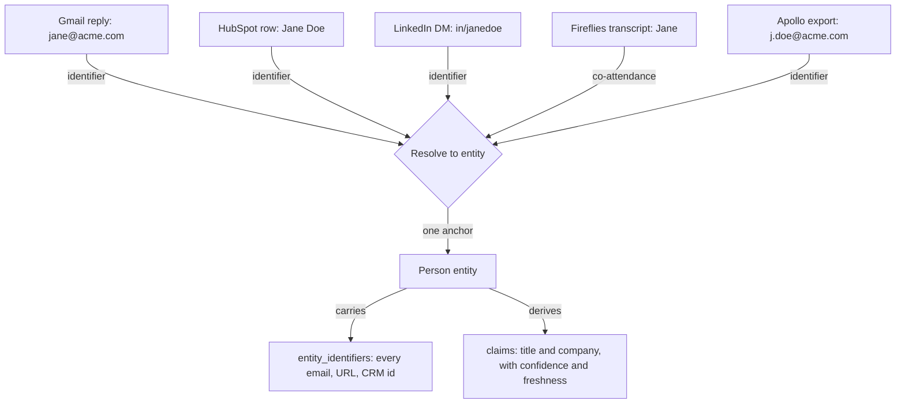
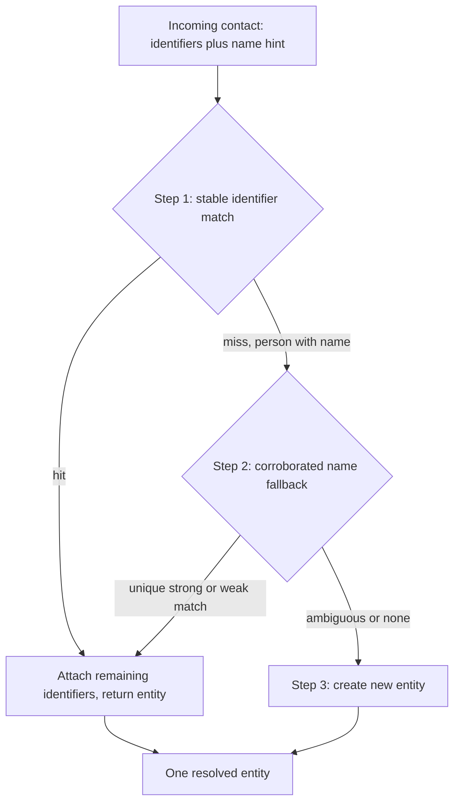
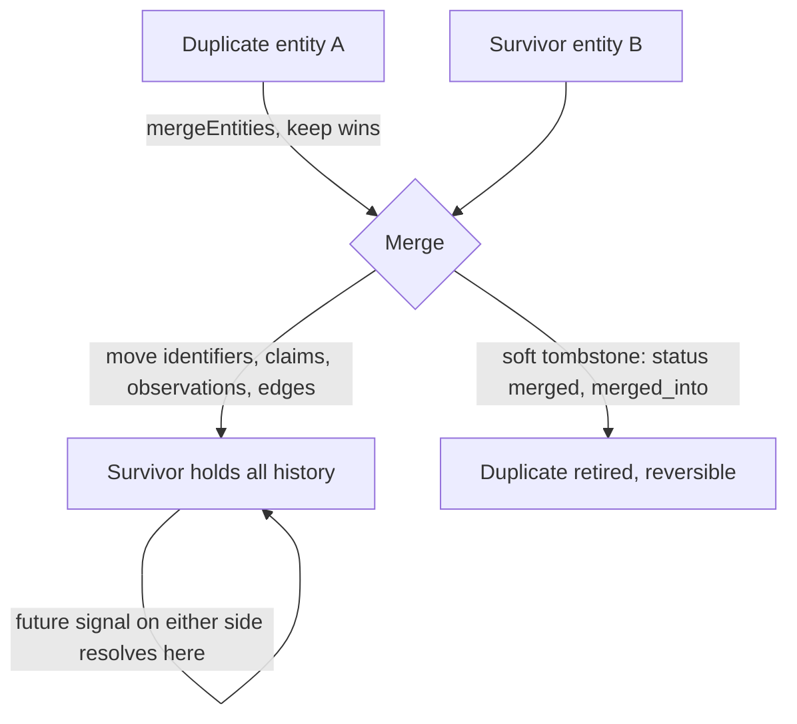

# Identity Resolution

Your prospects and customers show up everywhere: a reply in Gmail, a HubSpot row, a LinkedIn message, a Fireflies transcript, an Apollo export, a calendar invite. The same person often appears in several of these under a different email, a different name spelling, or a different profile link. Identity resolution is how Nous folds all of that into one account record per real person, so your team and your agents act on one trustworthy view instead of scattered fragments.

This document describes the actual infrastructure: the data model, the resolution waterfall, the corroboration filters, the cross source matching, and the merge path. It is precise rather than illustrative, and it points at the code.

---

## Why resolution comes first

A context graph is only as good as its identity layer. Senzing, a company that builds nothing but entity resolution, puts it bluntly: without resolution a knowledge graph is just disconnected facts, and every score computed on top of it is wrong. The same holds here. If `jane@acme.com` and `j.doe@acme.com` live as two records, an agent reasoning over either one is reasoning over half a person, and the ICP score, the timeline, and the next action are all computed on a fragment. Resolution is not data cleanup that runs before the graph. It is the precondition for the graph being a graph at all.

This is also the part you cannot prompt your way around. A model knows selling in general. It does not know that the Jane in a Fireflies transcript is the Jane in your CRM under a different address, or that a LinkedIn DM from an unseen handle belongs to a person you have spoken to for months. That knowledge is not in any model's weights. It exists only once something resolves the fragments into one entity and keeps them resolved as new signals arrive. At the scale of thousands of accounts times contacts times signals, that is not a prompt, it is infrastructure.

Two principles, borrowed from the resolution incumbents and enforced throughout the code below, make the layer trustworthy:

- **Full attribution.** Every source system and record key is preserved through a merge. The graph never forgets where a fact came from.
- **Explainable resolution.** When two records link, you can see why, and when the evidence is not strong enough, the system surfaces the ambiguity for a human instead of guessing.



---

## 1. The substrate

Identity resolution sits on four tables. Everything else is built from them.

| Table | Role | Key columns |
| --- | --- | --- |
| `entities` | The canonical, temporal anchor for one real thing (person, company, deal, workspace). Holds almost no data. Survives a job change or a new email. | `id`, `type`, `status ('active'|'merged')`, `merged_into` |
| `entity_identifiers` | The matching layer. Every email, LinkedIn URL, member id, and CRM id that points at an entity. One entity can carry many. | `entity_id`, `kind`, `value`, `status ('active'|'retired')`, `confidence` |
| `observations` | The append only provenance spine. Every raw event and asserted fact, with its source and timestamp. Never mutated. | `entity_id`, `kind`, `property`, `value`, `source`, `external_id`, `observed_at` |
| `claims` | The derived current best belief per property, recomputed from observations, carrying confidence and freshness. | `entity_id`, `property`, `value`, `confidence`, `freshness`, `epistemic_class`, `invalid_at` |

Two structural facts drive the whole design:

**Entities are anchors, not rows of data.** The person is the thing that matters. Their emails, LinkedIn profile, phone, and the IDs your tools assign all attach to that one entity. The entity itself has no name or company column; those are claims. This is why a person can change jobs, change emails, and keep one continuous history.

**One identifier resolves to exactly one active entity.** `entity_identifiers` carries a partial unique index that enforces it:

```sql
-- supabase/schema.sql
CREATE UNIQUE INDEX entity_identifiers_active
  ON entity_identifiers (workspace_id, kind, value) WHERE status = 'active';
```

A retired identifier keeps history without competing for resolution. The index is partial (`WHERE status = 'active'`), which is why writes go through `upsertIdentifier` rather than a plain PostgREST upsert (see §8).

### Valid identifier kinds

Built in `identifiersFromContactData` (`packages/core/src/db/entities.ts`) and written across the connectors:

| Kind | Origin | Normalisation |
| --- | --- | --- |
| `email` | Gmail, replies, bookings, enrichment | trim + lowercase |
| `linkedin_url` | LinkedIn connectors, enrichment | canonicalised to `https://www.linkedin.com/in/<handle>` |
| `linkedin_member_id` | Unipile / HeyReach | trim |
| `hubspot`, `pipedrive`, `salesforce`, `attio`, `crm` | CRM sync | trim |
| `apollo`, `rb2b` | Enrichment / intent providers | trim |
| `stripe` | Billing | trim |
| `domain` | Company entities | trim + lowercase, free domains excluded |
| `phone` | Declared, sparsely populated | trim |

Member URN URLs (`/in/ACoAA…`) are explicitly **not** accepted as a `linkedin_url`; they are opaque internal ids, not public handles (`isMemberUrnLinkedInUrl`, §6).

---

## 2. The resolution waterfall

The canonical resolver is `getOrCreateEntity` (`packages/core/src/db/entities.ts`). Every ingestion path ends here. It tries the strongest evidence first and only ever creates a new entity when nothing confident matches.



```
getOrCreateEntity(workspaceId, type, identifiers[], { nameHint? })
│
├─ STEP 1 — Stable identifier match
│   for each identifier (email, linkedin_url, linkedin_member_id, hubspot, …):
│     resolveEntity(identifier)  ──► hit ──► attach the rest, RETURN entity_id
│   (these rarely change, so they are the most reliable anchors)
│
├─ STEP 2 — Corroborated name fallback   (persons only, requires nameHint)
│   resolvePersonByNameFallback(identifiers, nameHint)
│     exact first-name anchor + surname corroboration ──► unique hit ──► attach, RETURN
│   (a shared name alone never links — see below)
│
└─ STEP 3 — Create
    insert entities(type, status='active'); attach identifiers; RETURN new id
    (a duplicate is cheap to fix later; a wrong merge is not)
```

### Step 1: stable identifiers win

`resolveEntity` looks the identifier up in `entity_identifiers`, scoped to the workspace, kind, and `status='active'`. For `linkedin_url` it matches against a variant set rather than a single string, so rows written before normalisation existed still resolve:

```ts
// resolveEntity — packages/core/src/db/entities.ts
if (identifier.kind === 'linkedin_url') {
  const variants = linkedInVariants(identifier.value);   // canonical, no-www, trailing slash, raw, lowercased
  const { data } = await supabase.from('entity_identifiers')
    .select('entity_id')
    .eq('workspace_id', workspaceId).eq('kind', 'linkedin_url')
    .in('value', variants).eq('status', 'active').limit(1);
  return data?.[0]?.entity_id ?? null;
}
// all other kinds: exact (workspace, kind, value, active) lookup
```

The first identifier that resolves wins. The remaining identifiers in the batch are attached to that entity (`attachIdentifiers`), which is how a second email or a LinkedIn URL gets folded onto the record on first contact. `attachIdentifiers` skips any value already active on another entity, so an attach never steals an identifier.

### Step 2: corroborated name fallback

When no identifier matches and the entity is a person, Nous tries to avoid forking a duplicate before it gives up. This is the step that prevents the duplicate a human would otherwise have to merge later. It is deliberately strict, because two different people share a name all the time.

`resolvePersonByNameFallback` (`packages/core/src/db/entities.ts`) anchors on an exact first name, then demands a second corroborating signal:

```ts
const fn = nameHint?.first_name?.trim().toLowerCase() ?? '';
const ln = nameHint?.last_name?.trim().toLowerCase()  ?? '';
if (fn.length < 2) return null;                  // need a first name to anchor
const emailLocal = incomingEmailLocal(identifiers);
if (!emailLocal && !ln) return null;             // need something to corroborate with

// candidates = existing entities whose first_name claim == fn
for (const [id, m] of byEntity) {
  if (m.first !== fn) continue;                  // anchor
  const cand = m.last ?? '';
  // STRONG: the incoming email's local part contains the candidate's surname
  if (emailLocal && cand.length >= 3 && emailLocal.includes(cand)) strong.push(id);
  // WEAK: surname is a prefix/initial of the candidate's surname
  else if (ln && cand && (cand === ln || cand.startsWith(ln) || ln.startsWith(cand))) weak.push(id);
}

if (strong.length === 1) return strong[0];       // accept — even if they already have an email
if (strong.length > 1)   return null;            // ambiguous — never guess
if (weak.length === 1) {
  // accept ONLY if the candidate has no email of its own (attaching is lossless)
  const { data: hasEmail } = await supabase.from('entity_identifiers')
    .select('id').eq('entity_id', weak[0]).eq('kind', 'email').eq('status', 'active').limit(1);
  if (!hasEmail?.length) return weak[0];
}
return null;
```

The two corroboration strengths:

- **Strong (surname token in the email):** `099ravipatel@gmail.com` joining as "Ravi P" matches the existing "Ravi Patel" because the email local part `ravipatel` contains the surname `patel`. High precision, so it is accepted even when the candidate already has an email.
- **Weak (name prefix):** an incoming surname that is a prefix or initial of a candidate's surname. Lossless only, so it is accepted only when the candidate has no email to overwrite.

Either way, more than one candidate at the same first name is treated as ambiguous and rejected. The fallback never guesses between two people.

### Step 3: create rather than guess

If both steps miss, Nous inserts a fresh `entities` row (`status='active'`) and attaches the incoming identifiers. A duplicate created here is recoverable by merge (§9). Fusing two real people is far harder to undo, so the system leans toward a clean new record.

---

## 3. The ingestion waterfall

`getOrCreateEntity` is the core, but most connector traffic arrives through `resolveContact` (`apps/worker/src/utils/resolveContact.mjs`), which wraps it with the contacts-table fast paths and one extra corroboration step before delegating to the core for creation.

```
resolveContact(workspaceId, data, { createIfMissing })
│
├─ STEP 1   Identifier match via resolveEntity (email, linkedin_url, member_id, hubspot, …)
│             hit ──► mergeContact (fill blanks only) ──► RETURN
│
├─ STEP 2   Name heal — existing contact, matching first+last, NO email
│             unique hit ──► write the incoming email in ──► register identifier ──► RETURN
│
├─ STEP 2.5 Corroborated cross-email — existing contact(s) WITH email at the same name
│             require domain/company corroboration (§5):
│               exactly 1 corroborates ──► attach the new email as an alternate ──► RETURN
│               name matches but nothing corroborates ──► remember as duplicateCandidates
│
└─ STEP 3   Create — getOrCreateEntity(..., { nameHint: { first_name, last_name } })
              if duplicateCandidates exist, write a "Data Quality" note flagging the
              likely duplicate for human review (never auto-merged)
```

Two things to note:

- **`mergeContact` only fills blanks.** It writes a field only when the existing value is null or empty. Ingestion never overwrites data already on the record.
- **Ambiguity is surfaced, not resolved.** When a name matches existing people but nothing corroborates (or more than one corroborates), Nous still creates the new record and leaves an auditable note rather than forcing a link. That note is what you see in the **Intel / Data Quality** tab.

Not every connector uses `resolveContact`. LinkedIn has its own waterfall (§6, identifier rich). The Gmail poller is update only and looks up by email directly. Meetings use a dedicated layer that never creates (§4).

---

## 4. Meetings: resolving through the calendar

A meeting is an event with attendees, not just an email and a name. The Fireflies and Fathom handlers and the calendar poller all funnel through `resolveMeetingContacts` (`apps/worker/src/utils/resolveMeeting.mjs`), which matches by identity **and** by co-attendance, and which never creates a contact (`createIfMissing: false`).

```
resolveMeetingContacts({ startTime, title, attendees, organizerEmail, source })
│
├─ STEP 1  Identity match each attendee email (organizer excluded). EMAIL ONLY.
│
├─ STEP 2  Co-attendance — match this meeting to an existing booking observation
│            within ±2h of start time, GUARDED by a name-in-title check:
│              a contact co-attends only if the title contains their first or last name
│
└─ STEP 3  Corroborated cross-email learning
             if exactly ONE prospect co-attends AND exactly ONE attendee email is
             still unresolved, attach that email to the prospect and log a Data
             Quality note. Any other count → skip.
```

The co-attendance guard is the safety rail:

```js
// resolveMeeting.mjs — a contact co-attends only if the title names them
if ((fn.length > 2 && titleLc.includes(fn)) || (ln.length > 2 && titleLc.includes(ln))) {
  matched.push(c.id);
}
```

This is what lets a Fireflies transcript reach the right record even when the attendee joined from an address you had never seen, while stopping two back-to-back calls with generic titles from fusing the wrong people. When the learning step fires it writes the new email as an identifier and an auditable note (`flag: co_attendance_email_link`, confidence 0.7) so it can be unlinked if wrong.

---

## 5. The corroboration filter

Steps 2.5 (ingestion) and the meeting learning step both gate cross-email links on the same predicate: `corroboratesIdentity` (`apps/worker/src/utils/identityMatch.mjs`). A matching name is the trigger; corroboration is the permission.

```js
export function corroboratesIdentity(candidate, incomingDomain) {
  if (!incomingDomain || FREE_EMAIL_DOMAINS.has(incomingDomain)) return false;  // free domain proves nothing
  // links only when the incoming work domain matches the candidate's stored
  // domain, their company, or the domain of an email already on the record
  …
}
```

The rule in one line: a name match plus a **work** domain that lines up with what we already know is enough to attach a second email; a name match alone, or a name match plus a free mailbox, is not. Free and consumer mailboxes (`gmail.com`, `gmx.de`, …) never corroborate, because a personal address tells you how to reach someone but nothing about who they work for.

---

## 6. LinkedIn: resolving the real profile

LinkedIn sometimes hands us an encoded member URN (`/in/ACoAA…`) rather than a public handle. Treating that URN as a new person's URL was the original source of LinkedIn duplicates. The LinkedIn handler (`apps/worker/src/webhooks/handlers/linkedin.mjs`) runs a four step waterfall with a URN healing step in the middle:

```
1. Identifier match      linkedin_member_id, then linkedin_url (exact)
2. URL slug ilike        variant match against the contacts table
2.5 Member-URN heal      if we only have a member id (or an ACoAA… URL):
                           fetch the vanity handle from Unipile ONCE,
                           retry the URL match, and on a hit register BOTH
                           linkedin_member_id and the healed linkedin_url so
                           step 1 succeeds next time
3. First+last name        contacts-only fallback, UNIQUE match required
4. Create                 using the healed vanity URL, never the raw URN
```

The healing step (§2.5 above) is the fix that stops a LinkedIn DM from forking a new record off a person you already have. `isMemberUrnLinkedInUrl` keeps the opaque URN out of the identifier set everywhere, so the record stores a real, scrapeable handle that will string-match on the next signal. Connection events are also de-duplicated against existing `linkedin_connected` activity, because Unipile re-fires `new_relation` on re-auth.

---

## 7. Enrichment adds, it never erases

When Nous enriches from Apollo, Prospeo, or LinkedIn, it fills gaps and leaves your good data alone. Three guarantees, each enforced in code:

**Manual edits are pinned.** A value you set by hand (or a workflow PATCH) is written as an `asserted` claim with `confidence 1.0`. The derivation engine refuses to overwrite it:

```ts
// recomputeClaim — packages/core/src/db/claims.ts
if (existing?.epistemic_class === 'asserted') return;   // ground truth — derivation must not touch it
```

**Provider facts are added under their true source.** Enrichment fields are written as observations tagged with the provider (`recordEnrichmentObservations`), and stripped from the contacts-view update so the view trigger cannot re-tag them with the record's origin source. Provenance survives, so you can always see that a title came from Apollo rather than from a reply.

**New emails are alternates; new roles go to the background.** A discovered email is attached as an identifier via `upsertIdentifier` and never swaps the primary. A person's full role history is stored as a `positions` observation, with the current role surfaced as the claim and the others kept for agents to draw on. A founder who enrichment also lists as a coach at a second company keeps the founder role you trust as primary.

---

## 8. Writing identifiers safely

The partial unique index on `entity_identifiers` (active rows only) cannot be targeted by a PostgREST `onConflict` upsert, so identifier writes go through `upsertIdentifier` (`packages/core/src/db/entities.ts`), a deliberate reactivate-or-insert:

```ts
// 1. already on THIS entity (any status)? → ensure it's active, done.
// 2. otherwise plain insert; a 23505 means the value is ACTIVE on ANOTHER entity.
//    Return false rather than steal it — that collision is an identity boundary.
```

The return value is load bearing: `true` means the identifier is now active on this entity; `false` means another entity already owns it actively, and the caller must not move it. This is the low level guarantee behind "one identifier, one entity."

---

## 9. Merge: the reversible cure

Prevention is not perfect, so duplicates get cured by `mergeEntities` (`packages/core/src/db/entities.ts`), which is lossless and reversible. The caller chooses the survivor (`keep`) and the duplicate to fold in (`drop`).



What moves, with a keep-wins conflict policy throughout:

| Layer | Policy |
| --- | --- |
| Identifiers | move drop's active identifiers to keep, unless keep already holds that value (collision left on the tombstone) |
| Claims | move only properties keep does not already have; conflicts stay on the tombstone |
| Observations | move all except `(source, external_id)` duplicates |
| Relationships | re-point both ends; drop self loops and duplicate edges |
| Collections, predictions, leads, logs, … | re-point or dedupe |

The drop is then soft-tombstoned: `status='merged'`, `merged_into=keep`. Because `resolveEntity` only ever reads `status='active'`, the tombstone instantly drops out of resolution, and because every identifier re-attached to the survivor, a future match on **either** side resolves to the one account. The merge is reversible by re-activating the tombstone.

Two entry points:

- **MCP tool `merge_contacts`** (`apps/mcp/src/server.js`) — for agents. `keep` and `drop` may each be an email, LinkedIn URL, entity UUID, or name. A name that matches several people returns candidates so the agent can confirm with the user and re-call with ids. It never merges on an ambiguous term.
- **`POST /v2/accounts/merge`** (`apps/api/src/routes/v2/accounts.mjs`) — resolves both terms via `resolveFocus`, rejects ambiguous or same-entity inputs, then calls `mergeEntities` and returns a summary of what moved.

---

## Planned: normalized local-part matching

> Status: **not yet built.** This is the next resolution tier, documented here so
> the design is settled before the code lands. Everything above this line is live.

The waterfall in §2 anchors its name fallback on an *existing name claim*. That
leaves one real gap: a stray record that is nothing but a bare email, with no
name to anchor on. A member who signs up as `jordanlee03@gmail.com` while an
older prospect record already exists as `jordanlee04@gmail.com` forks into two
entities, because Step 1 finds no shared identifier and Step 2 has no first name
to match. Same person, two emails, two records.

The fix is a new tier that matches on the **email local part itself**, after
normalising away everything a human treats as noise. Strip the local part to
letters only (drop digits, dots, plus-tags, underscores, hyphens) and compare:

```
jordanlee03  →  jordanlee        first.last   →  firstlast
jordanlee04  →  jordanlee        firstlast    →  firstlast
                ── identical ──                  ── identical ──
```

Both of these collapse to an **exact** match after normalisation, so this is not
fuzzy matching and there is no similarity threshold to tune — it is an equality
check on a normalised key. A trailing number or an inserted period, the two most
common ways one person ends up with two addresses, both resolve here.

Precision comes from the gates, in the same spirit as the rest of the layer:

- **Same domain required.** `jordanlee@gmail.com` and `jordanlee@acme.com`
  normalise identically but are not necessarily one person, so the domains must
  also match (or a name/other identifier must corroborate).
- **Unique candidate only.** More than one existing entity sharing the normalised
  local part at the same domain is ambiguous, so it is skipped, never guessed.
- **Auto-merge only at exact-after-normalisation.** True fuzzy cases — a typo like
  `alex` vs `alexx`, a dropped letter in `jordanlee` vs `jordanle` — sit one edit
  apart and would need edit-distance matching. Because a wrong merge fuses two
  real people, those never auto-merge; they surface as a Data Quality
  "possible duplicate" note for one-click human confirmation, exactly like the
  ambiguous ingestion cases in §3.

Two placements: as a new step in `resolvePersonByNameFallback` (catches the fork
at ingest time), and as a periodic dedup sweep over existing entities (the
`04` record already existed before `03` arrived, so an at-ingest check alone
never re-examines the pair — a nightly pass proposes the merge on data already
written).

---

## 10. The guarantees, and the guards that enforce them

The expensive failure in any context graph is fusing two real people into one. Every link path above is gated so that cannot happen quietly.

| Guarantee | Guard | Where |
| --- | --- | --- |
| One identifier resolves to one entity | partial unique index + `upsertIdentifier` returning `false` on collision | schema, `entities.ts` |
| A merged entity never resolves | `resolveEntity` filters `status='active'` | `entities.ts` |
| A shared name never links by itself | name fallback requires surname corroboration and a unique candidate | `entities.ts` |
| A cross-email link needs a real signal | `corroboratesIdentity` requires a matching work domain; free domains rejected | `identityMatch.mjs` |
| A meeting never fuses generic-title calls | co-attendance requires the contact's name in the title | `resolveMeeting.mjs` |
| A LinkedIn URN never forks a record | URN healed to a vanity handle before a create decision | `linkedin.mjs` |
| Enrichment never erases your data | asserted-claim pin; alternates over swaps; provenance preserved | `claims.ts`, `enrichContact.mjs` |
| Uncertain cases reach a human | ambiguous ingestion writes a Data Quality note instead of merging | `resolveContact.mjs`, `resolveMeeting.mjs` |
| Every link is reversible | merge tombstones rather than deletes | `entities.ts` |

---

## 11. What you get

One clean record per person that gathers every touch across Gmail, LinkedIn, HubSpot, Apollo, Fireflies, and your calendar, on a substrate that records where each fact came from and how much to trust it. Your team reads one history. Your agents act on one set of facts. The record sharpens as more signals arrive, and on the rare occasion two records should have been one, a single reversible merge folds them together and every future signal lands on the survivor.
