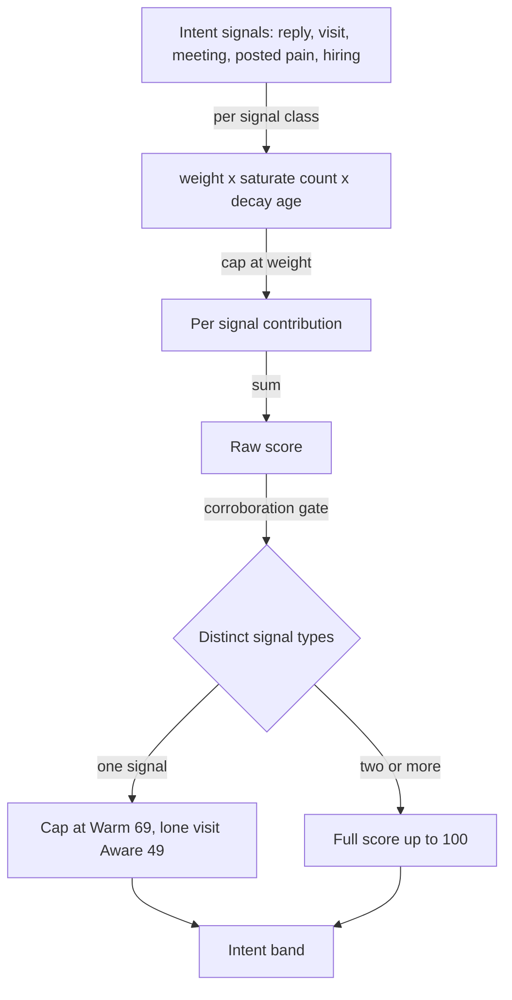
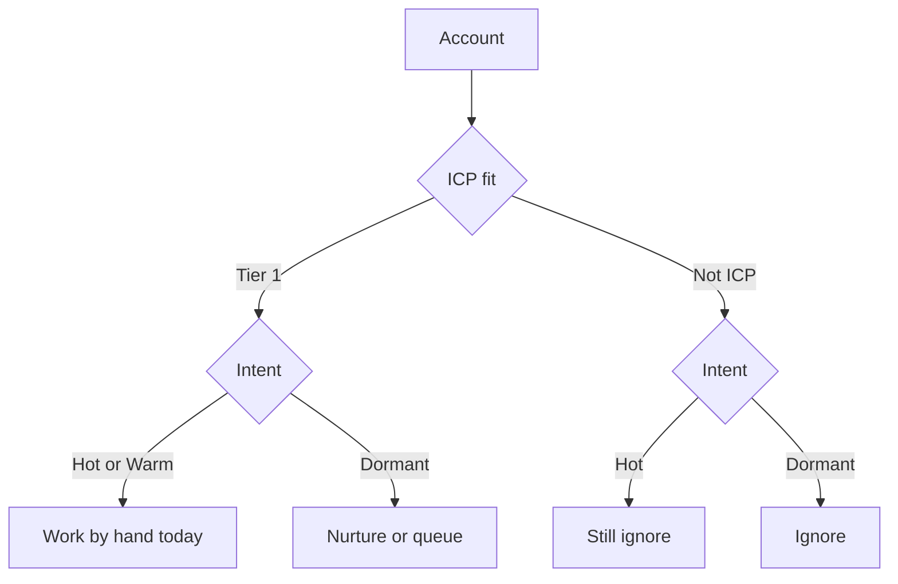
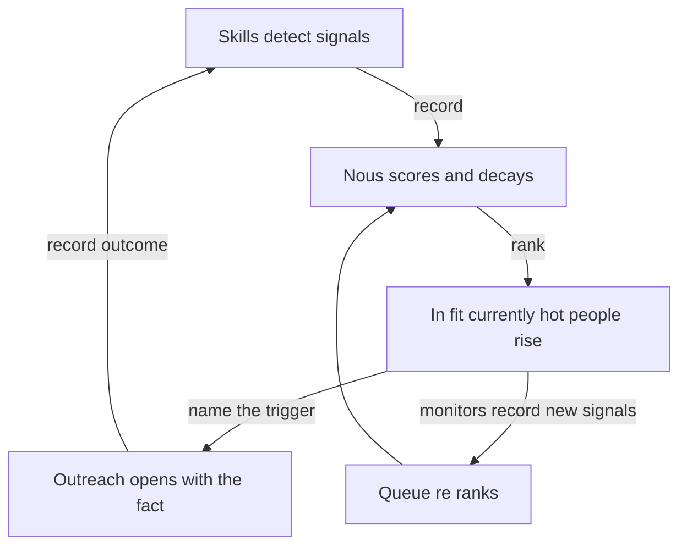

# Intent Score

[ICP fit](./icp-scoring.md) answers *who* you should sell to. It is a durable judgement about whether an account matches your business, and it barely moves week to week. Knowing an account is a great fit does not tell you *when* to reach out. That is a different question with a different shape, because it decays. Someone who engaged your post yesterday, replied last week, and has a meeting booked is **warm right now**. The same person silent for three months is not, even though their fit is identical.

The **intent score** is that second axis, a 0 to 100 measure of *reach out now?*, computed from behavioural signals and recency-weighted so it fades as activity cools. It is deliberately kept **separate from the fit score**. Blending them into one number destroys the most useful distinction in outbound, "great fit, quiet" (nurture) versus "great fit, on fire" (work today). Fit filters, intent times.

This document describes the actual infrastructure: the substrate, the scorer and its anti-over-prioritization rules, the signal catalog, the bands and the Fit×Intent play, the worker and cadence, the read overlay across surfaces, and the honest limits. It is precise rather than illustrative, and it points at the code.

---

## 1. The substrate

Intent scoring reuses the same evidence substrate as [identity resolution](./identity-resolution.md) and [ICP scoring](./icp-scoring.md): `entities`, `observations`, `claims`. It adds **no tables and no migration**.

| Store | Role | Shape |
| --- | --- | --- |
| `observations` (`interaction.*`) | The append-only behavioural spine. Every meeting, reply, LinkedIn touch, and (later) website visit, with its timestamp and source. The raw fuel the score decays over. | `entity_id`, `property`, `source`, `observed_at` |
| `claims` (`intent_score`, `intent_band`) | The derived current intent per entity, recomputed each run. Written `epistemic_class: 'inferred'` so it is **refreshable**, never `asserted`, never locked. | `entity_id`, `property`, `value`, `epistemic_class`, `computed_at` |

Two structural facts drive the design:

**Intent is a derived claim, not a bet.** Unlike `icp_fit` (a staked, immutable [prediction](./icp-scoring.md#1-the-substrate) you later grade), intent is a *current reading*. It is meant to be overwritten on every run as signals arrive and decay. So it lives in `claims` with `epistemic_class: 'inferred'`, which the derivation engine is free to supersede (it only refuses to overwrite `asserted` claims). Storing it as a refreshable claim is the whole point.

**The score is a pure, deterministic function, no LLM at score time.** Every input is a timestamped event. The score is weights × saturation × decay, gated. You can trace any intent number to the exact events that produced it.

---

## 2. The scorer

The core is `scoreIntent` (`apps/worker/src/intentScore.mjs`), pure given an entity's signal timestamps and the current time. Each signal class contributes `weight × saturate(count) × decay(age)`, capped at its weight. The contributions sum, then a corroboration gate applies.

```js
// scoreIntent - apps/worker/src/intentScore.mjs
const saturate = (n) => 1 - Math.exp(-n / 2);              // diminishing returns
const decay = (ageDays, halfLife) => 0.5 ** (ageDays / halfLife);
contrib[cls] = Math.min(cfg.weight, cfg.weight * saturate(weightedN));
let score = Math.min(100, sum(contrib));
if (activeSignals.length < 2) score = Math.min(score, onlyWebsite ? 49 : 69);
```



### Anti-over-prioritization, the five rules

A naive intent score is dominated by whatever fires most, so one noisy channel (classically: anonymous website visits) fakes readiness. Five rules prevent that, and they are the heart of this design:

1. **Per-signal cap.** Each class contributes *at most* its weight. Fifty visits cannot exceed the visit cap.
2. **Saturation on repeats.** `1 − e^(−n/2)`: 1 event ≈ 0.39, 3 ≈ 0.78, 20 ≈ 1.0. The 20th visit adds almost nothing, so volume cannot run away.
3. **Recency decay.** `0.5^(age/halfLife)`. A visit (half-life 7 days) two weeks old barely counts. The score fades on its own.
4. **Corroboration gate.** A *single* active signal cannot reach the top bands. It caps at **Warm (69)**, and a lone *website visit* caps at **Aware (49)**. Hot/Red-hot require **≥2 distinct signal types** (e.g. a visit *and* a reply). One pageview can never look "ready."
5. **Fit overlay.** Intent never overrides fit. `Not-ICP + Hot` is still ignored in the play, because a hot signal on a bad-fit account does not promote it.

---

## 3. The signal taxonomy, the 2×2

Not all signals are the same kind, and the kind decides how a signal is computed. Every signal sits on **two independent axes**:

- **Fit vs Intent.** *Who they are* (durable, the [ICP score](./icp-scoring.md), never decays) versus *are they in-market now* (perishable, this score, decays).
- **Company vs Person.** Shared by everyone at the company (**inherited**) versus that individual's own behaviour (**not inherited**).

|  | **Company** | **Person** |
| --- | --- | --- |
| **Fit** → ICP score | industry, employee_count, tech stack, domain, exclusions | title, seniority, role |
| **Intent** → this score | hiring, momentum (funding / growth / launch / news), *inherited* | website visit, reply, meeting, posted pain, competitor engaged, creator engaged, **job change**, *individual* |

Three rules fall out of the grid. **(1)** Only intent decays. **(2)** Company intent inherits to every person, person intent does not. **(3)** The account's intent is the **max of its people**. One signal can fire **both** axes, because a **job change** is a person-intent spike *and* triggers a fit re-score (new employer means new firmographics).

### The intent catalog

Each row is weight (max contribution) × half-life (decay). These are the rows the scorer reads (`SIGNALS` in `intentScore.mjs`). Fit signals route to the scorecard, not here.

| Signal | Level | Weight | Half-life | Source observation | Skill |
| --- | --- | --- | --- | --- | --- |
| `website_visit` | person | 40 | 7d | `interaction.website_visit` | pixel *(P4)* |
| `meeting_booked` | person | 35 | 30d | `interaction.meeting_scheduled` / `_held` | have |
| `replied` | person | 35 | 30d | `interaction.email_replied` / `positive_reply` / `reply` / `linkedin_reply` | have |
| `linkedin_engaged` | person | 25 | 14d | `interaction.linkedin_message` / `_connected` / `_post_engagement` | have |
| `competitor_engaged` | person | 22 | 14d | `interaction.competitor_engagement` | content-scan |
| `posted_pain` | person | 20 | 21d | person `signal.intent` ≥6 | content-scan |
| `job_change` | person | 20 | 45d | `interaction.job_change` | linkedin-monitor *(P2)* |
| `creator_like` | person | 14 | 14d | `interaction.creator_engagement` | audience-monitor *(P3)* |
| `hiring` | company | 18 | 30d | company `signal.hiring` ≥6 *(inherited)* | signal-scan |
| `momentum` | company | 12 | 60d | company `signal.momentum` ≥6 *(inherited; folds funding / launch / news)* | signal-scan |

The two "engaged with US" rows (reply, meeting) are **follow-up** triggers. The in-market rows (posted_pain, competitor_engaged, creator_like, website_visit) are **cold-outreach** triggers. Both raise "act now," and the corroboration gate means it takes ≥2 of them to reach Hot. Outbound-only events (`*_sent`), `meeting_cancelled`, and `enrichment_run` are deliberately **not** intent.

---

## 4. The bands, and the Fit × Intent play

The score maps to a band (6sense-style stages):

| Band | Score | Meaning |
| --- | --- | --- |
| Red-hot | ≥85 | acting now |
| Hot | 70–84 | clear, current intent |
| Warm | 50–69 | building |
| Aware | 20–49 | early flickers |
| Dormant | <20 | no live intent |

The point is the **matrix with fit**, not either score alone:

- **Tier-1 + Hot** → work by hand, today.
- **Tier-1 + Dormant** → nurture / queue.
- **Not-ICP + Hot** → still ignore.

Fit says who, intent says when, the cell says what to do.



---

## 5. The worker and cadence

`scoreIntentCron` (`apps/worker/src/intentScore.mjs`) runs every 6 hours (`cron.schedule('15 */6 * * *', …)` in `apps/worker/src/index.mjs`). It finds every entity with a recent `interaction.*` observation (last 180 days) per workspace, gathers its signals plus its company's inherited `signal.*`, scores it, and **upserts the `intent_score`/`intent_band` claims** for anything that clears the floor (`STAKE_FLOOR = 20`, i.e. Aware+). Entities with no live intent are left to default to Dormant at read time, so no hollow claims are written.

Run it by hand for a preview (writes nothing) or to backfill:

```bash
# from apps/worker, with workspace Supabase creds in env
node src/intentScore.mjs                 # preview the default list
LIST_ID=<uuid> node src/intentScore.mjs  # preview one list
node src/intentScore.mjs --write         # stake claims, workspace-wide
```

---

## 6. How it surfaces

One read overlay, `fetchIntentByEntity` (`apps/api/src/lib/icpFit.mjs`), the sibling of `fetchIcpByEntity`, batch-reads the `intent_score`/`intent_band` claims so every surface shows the same number. Entities with no claim default to **Dormant / 0**.

- **Lead lists** and the **People** page overlay it at read time (`leadLists.mjs`, `contacts.mjs`) and render a coloured band pill. People has an **Intent filter** (Hot / Warm / …).
- **Companies / Accounts** roll it up **max-of-people** (`buildCompanies`, `entities.tsx`), so an account is as hot as its hottest person, the one you would actually reach.

The same column on every surface means a number that never disagrees across the product.

---

## 7. Where the signals come from, skills not platform polling

The engine scores evidence. **Skills produce the evidence**, and Nous is where it is saved and scored. Skills are free and run on the user's own keys (BYOK Apify / verifiers). Nous is the system of record and the scorer. Each signal is owned by a skill that calls `record` (an `interaction.*` event) or `record_signal` (a company `signal.*`), and it lights up in the score on the next cycle, with **no scoring-code change** to add one.

| Skill | Produces | Status |
| --- | --- | --- |
| `signal-scan` | company fit (industry/size/stack/domain, exclusions) **+** company intent (`hiring`, `momentum`, incl. funding / launch / news) | live |
| `content-scan` | person intent, `posted_pain` (`signal.intent`) **+** `competitor_engaged` from named competitor mentions | live |
| `linkedin-monitor` | `job_change`, headcount growth, new on-theme post | planned (P2) |
| `competitor-/creator-audience-monitor` | `competitor_engaged`, `creator_like` from watching a competitor's / creator's own posts | planned (P3) |
| `news-funding` · `visitor-pixel` · `technographic` | funding/news, `website_visit`, tech-stack | planned (P3–P4) |

### The monitor layer (planned): delta on snapshot, not blind re-scrape

Most signals are not one-off enrichment, they are *changes over time*. Because Nous already stores prior state (the person's title, company, `employee_count`, last post), monitoring is **diff the new read against what Nous already knows, and record a signal only on change**. That is the line between "scraping" and "monitoring." Four parts:

**1 · The watchlist (scope the world down first).** You never "monitor LinkedIn," you monitor *these* entities. The watchlist is assembled from what the workspace already has:
- saved/ICP-qualified **people** (the lead lists, the Tier-1/2 set),
- **tracked companies** (the account list),
- **tracked titles / keywords** (boolean watches for new matches),
- **competitors** and **creators** (whose audiences you watch, see the moves below),
so a run is "re-check these 20,000," never "crawl everything."

**2 · Cadence, per scrape-source, tiered by account, slow by default.** The unit of scheduling is the **scrape**, not the signal. *One* profile re-scrape yields `job_change` + "new post exists" + headline change. *One* company-page scrape yields `headcount` + `hiring` for everyone there. So there are ~5 monitor jobs, each with its own cadence, and the account's priority scales it. The numbers are **slow by default, fast only for the hot subset**. On a 5,000-record list you check the ~300–500 active accounts often and the cold majority weekly.

| Scrape source → signals | Cold (the bulk) | Warm / Tier-2 | Hot / Tier-1 |
| --- | --- | --- | --- |
| **person profile** → job_change, new-post-exists, headline | every 2wk | weekly | 48h |
| **person posts/activity** → engagement, competitor, pain | skip until ICP-qualified | weekly | 24h |
| **company page** → headcount, hiring | weekly (per company) | weekly | 2–3d |
| **news source** → funding, news | daily (cheap, all) | daily | daily |
| **competitor/creator posts** → audience | 12–24h (few targets) | n/a | n/a |
| **website pixel** → visit | realtime push (no poll) | n/a | n/a |

The cadence tracks the signal's half-life (a 14d engagement is worth checking far more often than a 45d job change), but cost is the real governor. **The production math (Apify BYOK, ~$0.004/light profile):** checking all 5,000 hourly ≈ **$14k/mo** (never), every 24h ≈ $600, **weekly ≈ $87**. So all-in continuous monitoring of 5,000 records lands at **~$150–250/mo**, a weekly baseline plus a small hot subset plus company-level checks that scale by *company* count (~1,500), not people count. Funding/news come from a **news source, not a scrape** (cheaper, near-realtime).

**3 · The diff engine (the actual magic).** Each watched entity has a **last-known state** (stored as claims). On each run, snapshot → compare → emit a signal *only on a real change*:
```
Run N:    Person A  company=OpenAI     title=GTM Engineer
Run N+1:  Person A  company=Anthropic  title=Founding GTM Engineer
DIFF →    company changed  → interaction.job_change (intent + fit re-score)
          title changed    → interaction.job_change
```
Same for `employee_count` ↑ → headcount/hiring, a new `last_post_id` → new-post, a new name in a competitor's engagers → competitor_engaged. The signal is the *delta*, not the value.

**4 · Cheap-check-first.** Re-read the cheapest field (a company's People-tab *count*, a profile headline, the latest-post id) before any deep scrape. Deep-scrape only *after* a delta is detected. You pay for the check, not for reprocessing.

Two moves do double duty: monitor a **company's** People-tab count once to lift *every* person there, and monitor a **competitor's/creator's** posts once to capture *all* the prospects engaging (intent) plus brand-new ones (discovery).

---

## 8. From signal to outreach: why this exists

The score is not the product. **The action is.** Fit (the [ICP score](./icp-scoring.md)) tells you *who* belongs in the list. Intent tells you *when* a specific person is worth a message *today*. Together they drive the play:

1. **Surface.** Filter the list to `Tier-1 + Hot/Warm`, the in-fit people with a live signal. That is the day's work-list, not the whole 2,000.
2. **Name the trigger.** The signal carries a *fact*: the funding round, the competitor they are frustrated with, the pain they posted. The outreach skills (`cold-email`, `linkedin`) read that fact from the record and open with it, *"saw you raised…"*, *"you mentioned switching off…"*, which is why trigger-based outreach outperforms blind sends by a wide margin.
3. **Time it.** Because intent decays, the highest-scoring people are the ones who moved *recently*. Reach them while the signal is fresh.
4. **Re-rank, not re-blast.** As monitors record new signals, the work-list re-sorts itself. The operator (and the `abm-operator` agent) always works the top of a live, decaying queue instead of a static list.

So the loop is: **skills detect signals → Nous scores + decays them → the in-fit, currently-hot people rise → outreach names the trigger → the queue re-ranks.** That is the whole point of the intent axis.



---

## 9. Honest limits

- **The website-visit signal is wired but inert.** It needs a de-anonymizing visitor pixel (a later phase). Until then `website_visit` never fires, and the highest-weight 1st-party signal is dormant.
- **A cold list reads all-Dormant, correctly.** Intent accrues from engagement, and a freshly built list has none yet. That is the right answer, not a bug.
- **No 3rd-party intent** (keyword/competitor research, the "dark funnel"). That needs an external provider and is out of scope.
- **Engagement must be captured as a per-entity event** to count. The LinkedIn engagement worker emits `interaction.linkedin_post_engagement` per engager. Sources that only record list membership do not contribute.

---

## 10. The guarantees, and the guards that enforce them

- **Intent never fakes readiness from one channel**, guaranteed by the per-signal cap, saturation, and the corroboration gate (a lone signal cannot exceed Warm).
- **Intent never overrides fit.** `Not-ICP` accounts stay suppressed, and the score is read alongside the tier, never blended into it.
- **Intent is always current.** The claim is `inferred` (refreshable) and recomputed every 6 hours, so it decays without manual cleanup.
- **No migration, one source.** It rides the generic `claims`/`observations` tables and is read through a single overlay, so the lead list, People, and Companies can never show different intent for the same entity.

---

## 11. What you get

A second, honest axis next to ICP fit: who to sell to *and* when to move. The hot, in-fit accounts surface to the top of every list on their own, the quiet ones wait, and the noisy non-fits stay out. Your agents read the band and act on the cell of the matrix instead of guessing from a single number.
